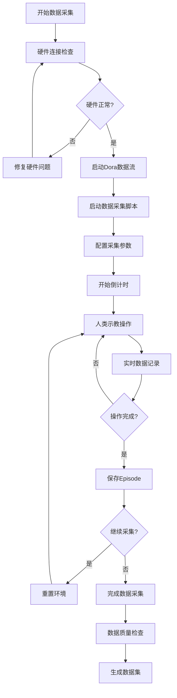
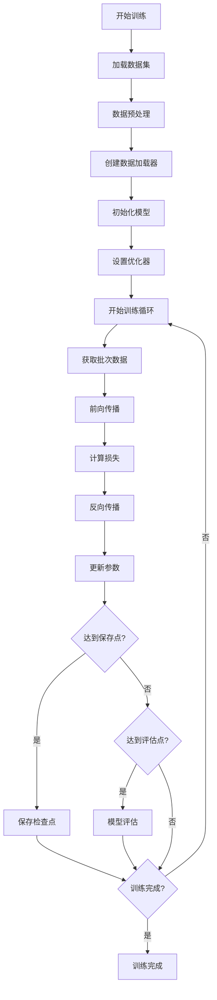
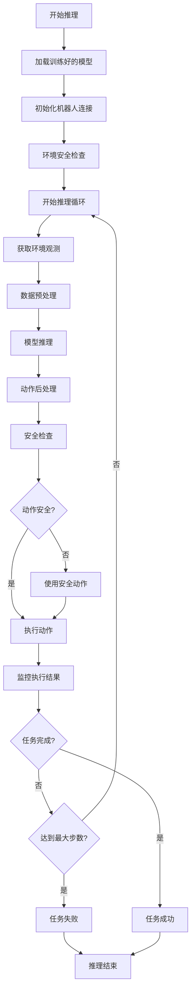

# DoRobot技术详解与工作流程

## 工作流程图

### 1. 数据采集工作流程



### 2. 模型训练工作流程



### 3. 模型推理工作流程



## 技术架构深度解析

### Dora数据流架构

Dora是DoRobot平台的核心数据流处理引擎，它提供了高性能、低延迟的数据处理能力。

#### 核心组件

1. **DataFlow Graph**: 数据流图定义了数据处理的拓扑结构
2. **Node**: 处理节点，每个节点负责特定的数据处理任务
3. **Event System**: 事件驱动系统，支持异步处理
4. **IPC Communication**: 进程间通信，支持分布式处理

#### 数据流示例

```yaml
# dora_teleoperate_dataflow.yml
nodes:
  - id: camera_node
    operator: python
    inputs:
      - source: camera/image
    outputs:
      - target: image_processor/image
      
  - id: image_processor
    operator: python
    inputs:
      - source: camera_node/image
    outputs:
      - target: recorder/image
      
  - id: recorder
    operator: python
    inputs:
      - source: image_processor/image
      - source: robot/joint_states
```

### LeRobot数据集格式

LeRobot提供了标准化的机器人数据集格式，支持多模态数据存储。

#### 数据结构

```json
{
  "info": {
    "fps": 30,
    "total_episodes": 100,
    "total_frames": 3000,
    "features": {
      "observation.images.image_top": {
        "shape": [480, 640, 3],
        "dtype": "uint8"
      },
      "observation.state": {
        "shape": [6],
        "dtype": "float32"
      },
      "action": {
        "shape": [6],
        "dtype": "float32"
      }
    }
  },
  "episodes": [
    {
      "episode_index": 0,
      "start_frame": 0,
      "end_frame": 29,
      "task": "pick and place"
    }
  ]
}
```

#### 数据存储

```
dataset/
├── data/
│   └── chunk-000/
│       ├── episode_000000.parquet
│       ├── episode_000001.parquet
│       └── ...
├── meta/
│   ├── info.json
│   ├── stats.json
│   └── tasks.jsonl
└── videos/
    └── chunk-000/
        ├── observation.images.image_top/
        │   ├── episode_000000.mp4
        │   └── ...
        └── observation.images.image_wrist/
            ├── episode_000000.mp4
            └── ...
```

### 机器人控制架构

#### SO101机器人配置

```python
@dataclass
class SO101RobotConfig:
    leader_arms: dict[str, MotorsBusConfig] = field(
        default_factory=lambda: {
            "main": FeetechMotorsBusConfig(
                port="/dev/ttyACM0",
                motors={
                    "joint_shoulder_pan": [1, "sts3215"],
                    "joint_shoulder_lift": [2, "sts3215"],
                    "joint_elbow_flex": [3, "sts3215"],
                    "joint_wrist_flex": [4, "sts3215"],
                    "joint_wrist_roll": [5, "sts3215"],
                    "joint_gripper": [6, "sts3215"],
                },
            ),
        }
    )
    
    follower_arms: dict[str, MotorsBusConfig] = field(
        default_factory=lambda: {
            "main": FeetechMotorsBusConfig(
                port="/dev/ttyACM1",
                motors={
                    "joint_shoulder_pan": [1, "sts3215"],
                    "joint_shoulder_lift": [2, "sts3215"],
                    "joint_elbow_flex": [3, "sts3215"],
                    "joint_wrist_flex": [4, "sts3215"],
                    "joint_wrist_roll": [5, "sts3215"],
                    "joint_gripper": [6, "sts3215"],
                },
            ),
        }
    )
    
    cameras: dict[str, CameraConfig] = field(
        default_factory=lambda: {
            "image_top": OpenCVCameraConfig(
                camera_index=0,
                fps=30,
                width=640,
                height=480,
            ),
            "image_wrist": OpenCVCameraConfig(
                camera_index=1,
                fps=30,
                width=640,
                height=480,
            ),
        }
    )
```

#### 数据同步机制

```python
def teleop_step(self, record_data=False):
    # 获取从臂关节角度
    follower_joint = {}
    for name in self.follower_arms:
        for match_name in recv_joint:
            if name in match_name:
                joint_data = recv_joint[match_name]
                follower_joint[name] = joint_data[:6]
    
    # 获取主臂关节角度
    leader_joint = {}
    for name in self.leader_arms:
        for match_name in recv_joint:
            if name in match_name:
                joint_data = recv_joint[match_name]
                leader_joint[name] = joint_data[:6]
    
    # 获取摄像头图像
    images = {}
    for name in self.cameras:
        images[name] = recv_images[name]
    
    return obs_dict, action_dict
```

## 学习算法详解

### ACT (Action Chunking Transformer)

ACT是一种基于Transformer的动作预测算法，特别适合机器人操作任务。

#### 核心思想
- 将连续的动作序列分解为动作块
- 使用Transformer处理序列依赖关系
- 通过自注意力机制学习动作间的关联

#### 网络架构
```
输入观测 → 视觉编码器 → Transformer → 动作解码器 → 输出动作
    ↓           ↓            ↓           ↓           ↓
  图像+状态    CNN特征    注意力机制    MLP层      动作序列
```

#### 训练过程
```python
def forward(self, batch):
    # 提取视觉特征
    visual_features = self.vision_encoder(batch['observation.images'])
    
    # 处理状态信息
    state_features = self.state_encoder(batch['observation.state'])
    
    # 特征融合
    combined_features = torch.cat([visual_features, state_features], dim=-1)
    
    # Transformer处理
    action_features = self.transformer(combined_features)
    
    # 动作预测
    actions = self.action_decoder(action_features)
    
    # 计算损失
    loss = self.loss_fn(actions, batch['action'])
    
    return loss, {'actions': actions}
```

### Diffusion Policy

Diffusion Policy基于扩散模型，通过去噪过程生成动作序列。

#### 核心思想
- 将动作生成建模为去噪过程
- 从噪声开始，逐步去噪得到清晰的动作
- 支持多模态输入和条件生成

#### 训练过程
```python
def forward(self, batch):
    # 添加噪声
    noise = torch.randn_like(batch['action'])
    t = torch.randint(0, self.num_timesteps, (batch['action'].shape[0],))
    noisy_actions = self.q_sample(batch['action'], t, noise)
    
    # 条件编码
    conditions = self.encode_conditions(batch['observation'])
    
    # 去噪预测
    predicted_noise = self.denoising_network(noisy_actions, t, conditions)
    
    # 计算损失
    loss = F.mse_loss(predicted_noise, noise)
    
    return loss, {'predicted_noise': predicted_noise}
```

### TDMPC (Temporal Difference Model Predictive Control)

TDMPC结合了模型预测控制和强化学习，适合需要精确控制的任务。

#### 核心思想
- 学习环境动态模型
- 使用模型预测未来状态
- 通过规划找到最优动作序列

#### 训练过程
```python
def forward(self, batch):
    # 学习环境模型
    next_states = self.world_model(batch['observation'], batch['action'])
    model_loss = F.mse_loss(next_states, batch['next_observation'])
    
    # 价值函数学习
    values = self.value_function(batch['observation'])
    value_loss = F.mse_loss(values, batch['returns'])
    
    # 策略学习
    actions = self.policy(batch['observation'])
    policy_loss = -self.value_function(batch['observation']).mean()
    
    total_loss = model_loss + value_loss + policy_loss
    
    return total_loss, {
        'model_loss': model_loss,
        'value_loss': value_loss,
        'policy_loss': policy_loss
    }
```

## 性能优化策略

### 数据加载优化

#### 1. 异步数据加载
```python
class AsyncDataLoader:
    def __init__(self, dataset, batch_size, num_workers=4):
        self.dataset = dataset
        self.batch_size = batch_size
        self.num_workers = num_workers
        
    def __iter__(self):
        # 使用多进程异步加载数据
        return DataLoader(
            self.dataset,
            batch_size=self.batch_size,
            num_workers=self.num_workers,
            pin_memory=True,
            prefetch_factor=2
        )
```

#### 2. 数据预处理优化
```python
class OptimizedTransforms:
    def __init__(self):
        self.image_transforms = torchvision.transforms.Compose([
            torchvision.transforms.Resize((224, 224)),
            torchvision.transforms.ToTensor(),
            torchvision.transforms.Normalize(mean=[0.485, 0.456, 0.406],
                                           std=[0.229, 0.224, 0.225])
        ])
    
    def __call__(self, sample):
        # 并行处理多个图像
        with ThreadPoolExecutor() as executor:
            futures = []
            for key, value in sample.items():
                if 'image' in key:
                    future = executor.submit(self.image_transforms, value)
                    futures.append((key, future))
            
            for key, future in futures:
                sample[key] = future.result()
        
        return sample
```

### 模型训练优化

#### 1. 混合精度训练
```python
def train_with_amp(model, dataloader, optimizer, scaler):
    model.train()
    for batch in dataloader:
        optimizer.zero_grad()
        
        # 使用自动混合精度
        with torch.cuda.amp.autocast():
            loss, outputs = model(batch)
        
        # 缩放损失并反向传播
        scaler.scale(loss).backward()
        scaler.step(optimizer)
        scaler.update()
```

#### 2. 梯度累积
```python
def train_with_gradient_accumulation(model, dataloader, optimizer, accumulation_steps=4):
    model.train()
    optimizer.zero_grad()
    
    for i, batch in enumerate(dataloader):
        loss, outputs = model(batch)
        loss = loss / accumulation_steps
        loss.backward()
        
        if (i + 1) % accumulation_steps == 0:
            optimizer.step()
            optimizer.zero_grad()
```

### 推理优化

#### 1. 模型量化
```python
def quantize_model(model):
    # 动态量化
    quantized_model = torch.quantization.quantize_dynamic(
        model, 
        {torch.nn.Linear, torch.nn.Conv2d}, 
        dtype=torch.qint8
    )
    return quantized_model
```

#### 2. 模型剪枝
```python
def prune_model(model, pruning_ratio=0.2):
    # 结构化剪枝
    for module in model.modules():
        if isinstance(module, torch.nn.Conv2d):
            prune.ln_structured(module, name='weight', amount=pruning_ratio, n=2, dim=0)
            prune.remove(module, 'weight')
    
    return model
```

## 安全机制

### 1. 动作安全检查
```python
class SafetyChecker:
    def __init__(self, joint_limits, max_velocity, max_acceleration):
        self.joint_limits = joint_limits
        self.max_velocity = max_velocity
        self.max_acceleration = max_acceleration
    
    def check_action(self, action, current_state):
        # 检查关节限制
        if not self.check_joint_limits(action):
            return False
        
        # 检查速度限制
        if not self.check_velocity_limits(action, current_state):
            return False
        
        # 检查加速度限制
        if not self.check_acceleration_limits(action, current_state):
            return False
        
        return True
    
    def check_joint_limits(self, action):
        for i, joint_action in enumerate(action):
            if joint_action < self.joint_limits[i][0] or joint_action > self.joint_limits[i][1]:
                return False
        return True
```

### 2. 紧急停止机制
```python
class EmergencyStop:
    def __init__(self):
        self.emergency_stop = False
        self.setup_signal_handlers()
    
    def setup_signal_handlers(self):
        signal.signal(signal.SIGINT, self.emergency_stop_handler)
        signal.signal(signal.SIGTERM, self.emergency_stop_handler)
    
    def emergency_stop_handler(self, signum, frame):
        self.emergency_stop = True
        print("Emergency stop activated!")
    
    def check_emergency_stop(self):
        return self.emergency_stop
```

### 3. 碰撞检测
```python
class CollisionDetector:
    def __init__(self, robot_model, obstacle_models):
        self.robot_model = robot_model
        self.obstacle_models = obstacle_models
    
    def check_collision(self, joint_positions):
        # 更新机器人模型
        self.robot_model.update_joint_positions(joint_positions)
        
        # 检查与障碍物的碰撞
        for obstacle in self.obstacle_models:
            if self.robot_model.check_collision(obstacle):
                return True
        
        return False
```

## 调试和监控

### 1. 日志系统
```python
import logging
import wandb

class Logger:
    def __init__(self, project_name, experiment_name):
        self.logger = logging.getLogger(__name__)
        self.setup_logging()
        
        # 初始化wandb
        wandb.init(project=project_name, name=experiment_name)
    
    def setup_logging(self):
        logging.basicConfig(
            level=logging.INFO,
            format='%(asctime)s - %(name)s - %(levelname)s - %(message)s',
            handlers=[
                logging.FileHandler('training.log'),
                logging.StreamHandler()
            ]
        )
    
    def log_metrics(self, metrics, step):
        self.logger.info(f"Step {step}: {metrics}")
        wandb.log(metrics, step=step)
    
    def log_video(self, video_path, step):
        wandb.log({"video": wandb.Video(video_path)}, step=step)
```

### 2. 性能监控
```python
class PerformanceMonitor:
    def __init__(self):
        self.metrics = {}
        self.start_time = time.time()
    
    def start_timer(self, name):
        self.metrics[name] = {'start': time.time()}
    
    def end_timer(self, name):
        if name in self.metrics:
            self.metrics[name]['duration'] = time.time() - self.metrics[name]['start']
    
    def get_metrics(self):
        return self.metrics
    
    def log_metrics(self, logger):
        for name, metric in self.metrics.items():
            if 'duration' in metric:
                logger.info(f"{name}: {metric['duration']:.3f}s")
```

---

*本技术详解文档提供了DoRobot平台的深度技术分析，帮助开发者更好地理解和使用平台。*
