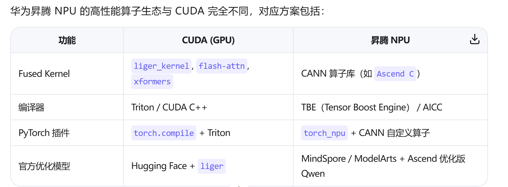

# liger_kernel对应NPU的什么


✅ NPU 上应使用华为官方提供的优化路径，例如：

使用 torch_npu 中的 fused ops（如 npu_rms_norm, npu_rotary_pos_emb）
或直接使用 MindSpore + CANN 运行 Qwen 系列模型（华为官方推荐）

# Deepspeed
`--per_device_train_batch_size 3` 和 `--gradient_accumulation_steps 2` 是深度学习训练中控制 **有效 batch size（effective batch size）** 的两个核心参数。它们共同决定了模型每步更新时使用的样本数量，尤其在分布式训练和显存受限场景中至关重要。

## 一、逐个解释

### 1. `--per_device_train_batch_size 3`
- **含义**：**每个设备**（GPU/NPU）上，**单次前向/反向传播处理的样本数**。
- **作用**：
  - 直接影响显存占用：batch_size 越大，显存越高；
  - 影响梯度的“噪声水平”：小 batch 梯度噪声大，大 batch 更稳定。

✅ 举例：
- 你有 8 张 NPU，`per_device_train_batch_size=3`
- 每次前向/反向，**每张卡处理 3 个样本**，共 `3 × 8 = 24` 个样本并行处理

---

### 2. `--gradient_accumulation_steps 2`
- **含义**：**累积多少次小 batch 的梯度后，才执行一次参数更新**。
- **作用**：
  - 在显存不足时，**模拟更大的 batch_size**；
  - 不增加显存（每次仍只处理 `per_device_batch_size`），但梯度等效于更大 batch。

✅ 举例：
- `gradient_accumulation_steps=2`
- 模型先对 batch 1 做 forward + backward → **梯度暂存**
- 再对 batch 2 做 forward + backward → **梯度累加**
- 第 2 步结束后 → **执行一次 optimizer.step()**（参数更新）

> 🔥 关键：**梯度是累加的**（`grad += current_grad`），而不是平均的（但通常会除以 steps 做归一化）

---

## 二、两者结合：计算 **Global Batch Size**

```python
global_batch_size = per_device_train_batch_size × gradient_accumulation_steps × world_size
```

- `world_size` = 总设备数（如 8 卡）

### 你的配置：
```bash
--per_device_train_batch_size 3
--gradient_accumulation_steps 2
# 假设 8 卡（NPROC_PER_NODE=8）
```

→ 
- **每步更新的总样本数**（global batch size） = `3 × 2 × 8 = 48`

| 步骤 | 每卡处理 | 全局样本 | 梯度更新 |
|------|--------|--------|--------|
| Step 1 | 3 样本 | 24 样本 | ❌ 不更新（累积）|
| Step 2 | 3 样本 | 24 样本 | ✅ 更新（累加 2 次梯度）|
| **每 2 个训练 step，模型参数更新 1 次** |

> 📌 注意：Hugging Face / ms-swift 的 **`global_step` 指的是参数更新次数**，不是 forward 次数。

## 三、为什么需要梯度累积？

### 场景：你想用 `global_batch_size=48`，但单卡显存只能放 `batch_size=3`
- 如果不用梯度累积：`3 × 8 = 24` → 实际 batch 太小，训练不稳定
- 用 `gradient_accumulation_steps=2`：**显存只用 batch=3，但效果等价于 batch=48**

✅ 优点：
- 显存压力小
- 训练更稳定（接近大 batch 行为）

⚠️ 缺点：
- 训练速度变慢（2 次 forward 才更新 1 次）
- 学习率可能需要调整（大 batch 通常用更大 lr）

---

## 四、在日志中的体现

你看到的训练日志：
```
Train: 0%| | 0/2401 [00:00<?, ?it/s]
```
- `2401` 是 **参数更新步数**（global steps），不是 forward 次数
- 实际 forward 次数 = `2401 × 2 = 4802`

---

## 五、与 DeepSpeed 的关系

- DeepSpeed 的 `train_batch_size` 在配置文件中通常指 **global batch size**
- 而 `per_device_train_batch_size` 是你传给 Trainer 的每卡 batch
- ms-swift 会自动协调两者，确保：
  ```python
  deepspeed_config['train_batch_size'] == per_device × grad_acc × world_size
  ```

---

## ✅ 总结

| 参数 | 控制对象 | 显存影响 | 作用 |
|------|--------|--------|------|
| `per_device_train_batch_size` | 每卡单次 forward 的样本数 | ⬆️ 越大显存越高 | 决定单次计算量 |
| `gradient_accumulation_steps` | 梯度累积步数 | ❌ 不增加显存 | 模拟更大的 global batch |

> 💡 **你的配置等效于：用 8 卡训练，每步更新基于 48 个样本的梯度，但每卡只放 3 个样本，显存友好。**