# 行业大模型训练数据不足？从零构建百万SFT样本的方法和工具

鉴于行业开源数据缺乏，客户数据质量低等问题， 我们在行业增训过程中，往往会构建大量合成数据，来缓解这些问题。对于如何获取高质量response, 我们也会在下文进行分享。

行业增量训练中， 最常见的需求是补充行业知识， 并完成特定的行业任务。 行业知识的学习可以通过对专业书籍进行SelfQA 或者从相关行业论坛中挖掘用户真实问题。 对于行业特定任务，可以使用SelfInstruct对种子指令进行泛化或者从已有SFT数据库中检索和任务相关的数据。如果某些特定领域有一些比较好的开源模型，也可以通过megpie的方式，获取该模型的一部分指令。

SelfQA（Self-supervised Question Answering）是一种利用无监督或自监督方式从纯文本中自动构造问答对（Question-Answer pairs）的技术。它特别适用于**领域知识密集型文本**（如专业书籍、技术手册、科研论文等），在缺乏人工标注数据的情况下，能够有效挖掘文本中的结构化知识，用于训练或增强问答系统、检索增强生成（RAG）、微调语言模型等任务。

---

### 1. **SelfQA 的核心思想**

SelfQA 的基本假设是：**一段连贯的叙述性文本中隐含了“问题—答案”的语义结构**。例如：

> “牛顿第二定律指出物体的加速度与作用于此物体上的净力成正比，与物体质量成反比。”

 可以自动生成问答对：

- **Q**: 牛顿第二定律的内容是什么？
- **A**: 物体的加速度与作用于此物体上的净力成正比，与物体质量成反比。

实现方式通常包括：

- **基于模板/规则**：利用句法结构（如主谓宾）、关键词（如“定义为”“是指”）提取问答。
- **基于预训练语言模型（PLM）**：使用如 T5、BART 等模型，通过“问答生成”（QG, Question Generation）和“答案抽取”（AE, Answer Extraction）两个子任务构建。
- **基于掩码语言建模（MLM）或因果语言建模（CLM）的自监督目标**：例如，随机掩码答案部分，让模型预测问题；或掩码问题词，让模型补全答案。

---

### 2. **在专业书籍上的应用优势**

- **知识密度高**：专业书籍通常包含大量定义、原理、因果关系、公式解释等，天然适合构建高质量问答对。
- **节省人工标注成本**：领域专家标注成本极高，SelfQA 可实现低成本知识抽取。
- **提升下游任务性能**：生成的问答对可用于：
  - 微调领域问答模型（如 BioBERT、Legal-BERT）；
  - 构建领域知识库；
  - 增强检索系统（如用 Q 作为查询，A 作为文档片段）；
  - 作为 RAG 的上下文训练数据。

---

### 3. **处理低质量 OCR 文本的特殊价值**

当原始数据来自**扫描版专业书籍的 OCR 输出**时，常存在以下问题：

- 文字识别错误（如“α”识别为“a”）；
- 段落结构混乱、公式/图表丢失；
- 标点缺失或错位，影响语义理解。

SelfQA 在这种场景下可起到**数据清洗与结构化重构**的作用：

- **语义一致性过滤**：通过问答对的逻辑合理性（如用判别模型或大模型打分）过滤低质量片段。例如，如果生成的问题与答案在语义上不匹配，说明原文可能 OCR 错误严重。
- **知识显式化**：将模糊、冗长的 OCR 文本转化为清晰的“Q-A”形式，便于后续使用。
- **错误鲁棒性**：现代语言模型（尤其是指令微调后的）具备一定容错能力，即使 OCR 有轻微错误，仍可能生成合理问答对。

> 示例：OCR 错误原文：“光台速度在真空虫为 299792458 m/s”
> 模型仍可能理解为“光速在真空中为...”，生成正确问答对。

---

### 4. **典型流程（Pipeline）**

1. **文本预处理**：分句、去噪、纠错（可选）；
2. **答案候选抽取**：使用 NER、关键词提取、依存句法分析等识别潜在答案（如名词短语、定义句）；
3. **问题生成（QG）**：以答案为条件，生成自然语言问题；
4. **问答对过滤**：用一致性打分、BLEURT、语义相似度或大模型判断 QA 是否匹配；
5. **后处理与增强**：去重、多样化改写、加入负样本等。

---

### 5. **挑战与注意事项**

- **幻觉问题**：生成的问题可能引入原文没有的信息；
- **答案粒度控制**：答案太长（整段）或太短（单个词）都不理想；
- **领域适配**：通用 QG 模型在专业领域效果可能下降，需领域微调；
- **评估困难**：缺乏黄金标准，常依赖人工抽查或下游任务验证。

---

### 总结

SelfQA 是一种高效、低成本地从无标注专业文本（包括低质量 OCR 数据）中提取结构化知识的手段。它不仅能**提升数据质量**，还能**显式建模领域知识**，为后续的问答系统、知识图谱构建、模型微调等提供高质量训练信号。在 AI for Science、法律、医疗、工程等专业场景中，具有重要实用价值。

Self-Instruct 是一种**利用语言模型自身（self-bootstrapping）从少量种子指令出发，自动合成大规模、高质量、多样化的指令-输出（instruction-response）数据**的方法。该方法由 Stanford 团队在 2022 年提出（《Self-Instruct: Aligning Language Models with Self-Generated Instructions》），其核心目标是**低成本地对齐语言模型与人类意图**，而无需大量人工标注。

在**领域任务**（如医疗问答、法律咨询、工业控制指令等）中，Self-Instruct 被证明能**最直接、高效地提升模型在特定任务上的表现**，原因在于它能以极低代价生成大量**符合目标领域语义、任务格式和表达习惯**的指令数据。

---

### 一、Self-Instruct 的基本原理

Self-Instruct 的核心思想是：

> **“让语言模型自己教自己如何遵循指令。”**

具体而言，它通过以下循环过程实现数据自举（bootstrapping）：

1. **输入少量人工编写的高质量种子指令**（seed instructions）；
2. **让语言模型基于这些种子生成新的指令**（instruction generation）；
3. **再让模型为新指令生成对应的输出**（response generation）；
4. **对生成的指令-输出对进行过滤和去重**；
5. **将合格样本加入指令池，用于下一轮生成**。

这个过程可以迭代多轮，指数级扩展指令数据集。

---

### 二、Self-Instruct 的典型流程（四步循环）

以领域任务（如“机械臂控制指令生成”）为例：

#### 步骤 1：准备种子指令（Seed Instructions）

人工编写 5–20 条高质量、覆盖不同子任务的指令。例如：

- “根据当前关节角度 [θ1=0.5, θ2=1.2] 和目标位置 (x=0.3, y=0.7)，生成下一时刻的关节角速度指令。”
- “将末端执行器从当前位置移动到 (x=0.5, y=0.5, z=0.2)，避开障碍物。”

#### 步骤 2：生成新指令（Instruction Generation）

提示语言模型：

> “你是一个机器人控制专家。请根据以下示例，生成一条新的、不同的指令，要求涉及机械臂运动规划或状态反馈。”

模型基于种子示例，生成新指令，如：

- “给定末端位置误差为 (Δx=0.1, Δy=-0.05)，计算所需关节调整量。”

#### 步骤 3：生成对应输出（Response Generation）

对每条新指令，再提示模型生成合理响应：

> “请为以下指令生成一个专业、准确的响应：[新指令]”

例如响应：

- “根据雅可比矩阵 J = [[...]], 关节调整量 Δθ = J⁺·[Δx, Δy]^T = [0.08, -0.03]。”

#### 步骤 4：过滤与去重（Filtering）

- **格式过滤**：剔除不完整、非指令形式的样本；
- **语义去重**：用 embedding 相似度（如 SBERT）去除重复指令；
- **质量过滤**（可选）：
  - 用判别模型判断响应是否合理；
  - 或通过“回测”：让另一个模型根据指令是否能重现响应内容；
  - 或人工抽查。

合格样本加入指令池，用于下一轮生成。

---

### 三、为什么 Self-Instruct 对领域任务提升最直接？

| 原因                  | 说明                                                                                                               |
| --------------------- | ------------------------------------------------------------------------------------------------------------------ |
| **1. 任务对齐性强**   | 生成的指令天然符合领域语言习惯和任务结构（如“生成控制指令”“解释故障代码”），避免通用指令的“语义漂移”。       |
| **2. 数据成本极低**   | 仅需少量领域专家编写种子，后续全自动生成，大幅降低标注成本。                                                       |
| **3. 覆盖长尾场景**   | 模型可泛化出人类未想到但合理的边缘案例（如异常传感器输入下的指令）。                                               |
| **4. 支持多粒度泛化** | 可控制生成“相似指令”（强化核心任务）或“多样指令”（拓展任务边界）。                                             |
| **5. 适配微调需求**   | 生成的 (instruction, response) 对可直接用于 SFT（监督微调），显著提升模型在下游任务的 zero-shot 或 few-shot 性能。 |

> 实验表明：在法律、医疗、代码等垂直领域，仅用 10 条种子 + Self-Instruct 生成 500 条指令微调后，模型性能可接近甚至超过使用 1000+ 条人工标注数据的效果。

---

### 四、进阶变体与优化策略

1. **Self-Instruct + 领域模型微调（Domain-Specific LM）**
   先用领域语料微调基础模型，再用该模型做 Self-Instruct，生成更专业指令。
2. **Controlled Generation**通过 prompt 控制生成方向，例如：

   - “生成一条关于**逆运动学求解**的指令”
   - “生成一条处理**传感器噪声**的控制指令”
3. **Negative Self-Instruct**
   主动生成错误指令或幻觉响应，用于训练模型的拒答或纠错能力。
4. **Hybrid Self-Instruct**
   结合规则模板（如“将 [变量] 从 [值1] 调整到 [值2]”）与语言模型生成，提升结构可控性。
5. **Iterative Refinement**
   用生成数据微调模型后，再用新模型进行下一轮 Self-Instruct，形成“生成 → 微调 → 更好生成”的正向循环。

---

---

### 六、局限与应对

| 挑战               | 应对策略                                                        |
| ------------------ | --------------------------------------------------------------- |
| **幻觉/错误知识**  | 引入外部知识库验证；使用 RAG 辅助生成；人工审核关键样本         |
| **指令质量不均**   | 强化过滤机制；使用更强模型生成；引入评分模型（如 Reward Model） |
| **领域术语偏差**   | 种子指令中显式包含专业术语；微调前加入术语 glossary             |
| **输出格式不一致** | 在 prompt 中严格规定响应格式（如 JSON、数值列表等）             |

---

* **MAGPIE**：是一种通过已有的开源模型自合成数据的方法 [3]。 通过输入该模型的提示词模板， 即可引导模型生成训练用的instruct. 例如，使用`<|im_start|>system\nYou are Qwen, created by Alibaba Cloud. You are a helpful assistant.<|im_end|>\n<|im_start|>user\n` 作为Qwen系列的模型输入，使用模型进行续写，就会生成训练时的指令。 Magpie已经开源了多个开源模型的指令集。 最近我们收集reasoner相关开源数据，鉴于开源的中文的STEM和通用逻辑推理数据集整体偏少，通过这种方式引导DeepSeek-R1 Distill 版本模型，额外补充了10万+ 相关数据， 相对于已有开源数据，补充Magpie数据之后， 在通用的逻辑推理任务上获得了大概10%左右提升。

通常来说，我们会例行根据已有的采购数据和爬取的相关网页数据, 通过selfqa和real-query的方式构造一批数据，保证尽可能全面覆盖该领域的问题。 然后会根据领域任务进行指令泛化。 根据领域的具体情况决定是否使用标签检索/相似检索 或者Magpie等数据构建方式。完成数据构建之后，会进行训练，验证新构建建的数据对模型训练的效果提升是否有帮助。

**基模型选择**：

根据具体的训练目标，选择合适的基模型。 通常，领域增量预训练过后的模型，领域知识会得到明显提升。 如果目标是重点提升领域知识，则可以优先选择增量预训练之后的模型。 如果更多关注领域任务，而且对通用任务的要求比较高，则领域增量预训练之后，有可能会破坏通用的chat能力。 为了补齐chat能力，可能需要和增量预训练的同事配合，在增量预训练阶段尽可能混入更多chat数据。 例如， 金融领域对通用chat能力要求很高，增量预训练之后，很容易破坏已有的chat能力。 但是当增量预训练过程中混合了四野全量SFT数据和我们自己构造的领域SFT数据之后， 整体领域任务相对直接使用L0有 2-3%提升。

**数据配比**

* 领域和通用任务配比： 金融领域SFT数据量级比较大，当前领域和通用任务整体维持在1:1的比例，可以在保证通用能力不下降的情况下，整体提升领域任务效果。
* 不同任务类型的数据配比： self-qa,  网页挖掘问答对，相似检索/标签检索等方式获取的数据， 通常量级非常大，且没有具体的任务指向性。实际训练配比过程中，一般可以只训练一个epoch。 而针对具体领域任务针对性构造的数据，则可以适当提升训练epoch数量，通常为3个epoch.
* 根据训练结果适当调整不同任务数据配比：任务类数据在训练过程中，最好在中间过程中将模型保存并进行自动化评测， 监控每个任务的训练动态， 验证模型在某些任务上是否收敛。 如果某个任务在训练过程中一直成增长趋势， 则可以适当增加该任务训练的epoch数量。 如果某个任务在加入了对应的构造数据之后，反而效果在下降，则大概率数据质量有问题。可以考虑通过偏好引导和BON的方式产生更好的答案。

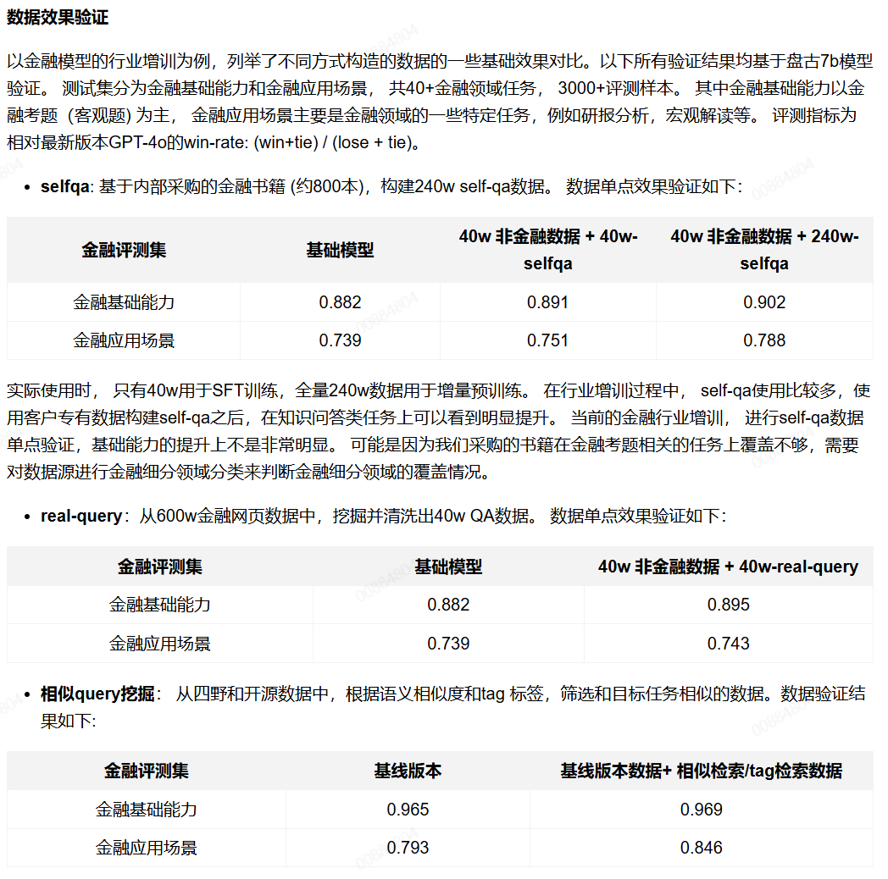

基线版本: 四野数据已经包含多个领域数据， 基线数据的领域数据通过四野数据目录，直接选择了所有金融领域数据。 但是通过数据目录选择，粒度较粗。 很多相关数据并不在金融领域的目录下面。

tag检索: 根据instag 标签 [5] 和验证集样本标签重合数量对数据库中样本进行排序和选择。

相似检索：根据语义相似度对数据库中样本进行选择。

可以看到，从已有数据库中筛选相似数据，可以筛选出更多对领域任务有益的数据。

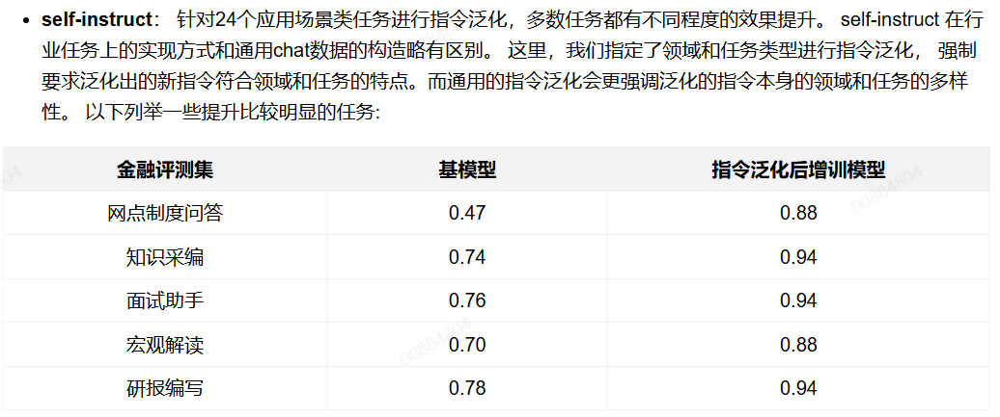

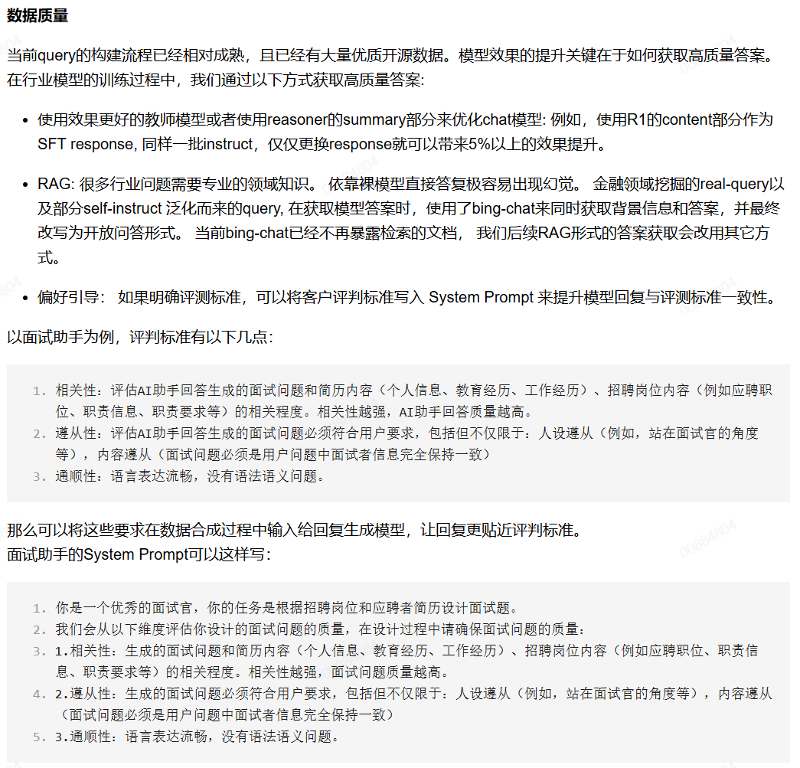

* 拒绝采样， 同时利用反馈信息，整体提升对齐效果。
  有些任务， 即使经过了偏好对齐采样， 依然不能得到有效提升。 主要有两个原因: 1. 即使使用偏好对齐采样，教师模型的答案依然不够好。 2. SFT没有利用负样本，单纯依靠正样本训练，不能让模型充分了解什么样的答案是不合适的。 可以考虑增加反馈信息。

  下面以前情摘要为例， 进行了一些对比实验， 首先对实验设定做一些解释。

  * GPT-4o BON采样（qwen-2.5-72b做为裁判模型筛选最优结果）：经过5次采样， 使用qwen-2.5-72b做裁判模型，选择最佳答案。
  * GPT4o , 不同版本的7b 模型的负样本反馈信息： 使用qwen-2.5-72b对三个模型的输出做BON裁判 （5个 GPT 4o结果，5个7b模型结果：分别来自于不同7b模型 )，输出裁判的思考过程和裁判结论，裁判的思考过程和结论作为SFT的response进行训练。

可以看到， 经过BON采样，同时增加反馈信息，可以使一个比较难优化的任务得到一定的效果提升。

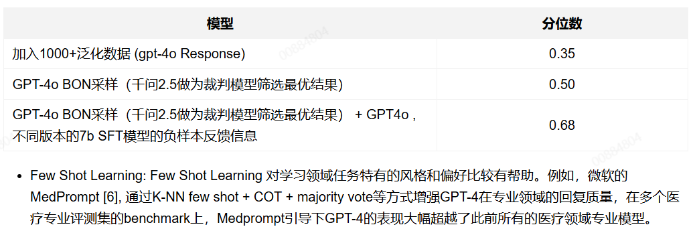

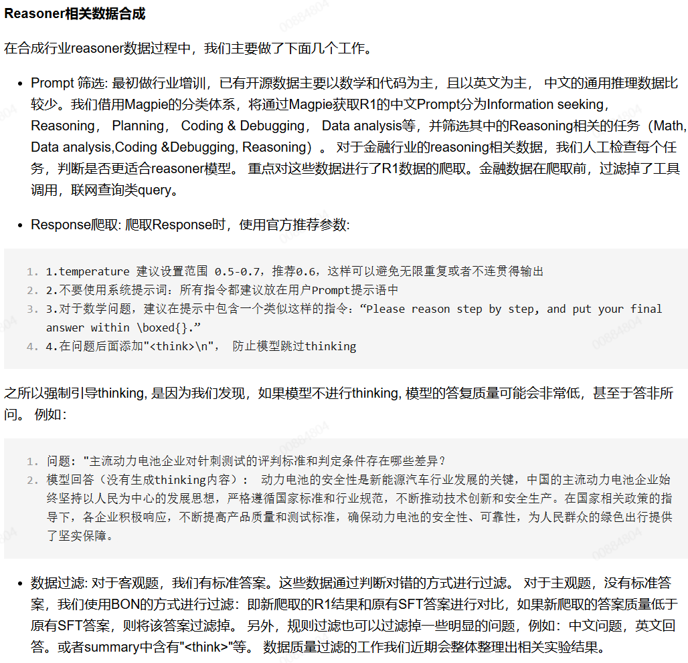

---

## 一、BON 采样（Best-of-N Sampling）

### 1. 基本思想

BON（Best-of-N）是一种**推理时（inference-time）的解码策略**：对同一个输入提示（prompt），模型**独立生成 N 个候选答案**，然后通过一个**外部的“评判器”（critic / reward model）** 对这些答案打分，**选择得分最高（质量最好）的那个作为最终输出**。

> 公式化表达：
> 给定 prompt \( x \)，生成 \( \{y_1, y_2, ..., y_N\} \sim p_\theta(y|x) \)
> 选择 \( y^* = \arg\max_{y_i} r(y_i, x) \)，其中 \( r(\cdot) \) 是奖励函数（如 reward model 的输出）

### 2. 关键组件

- **生成模型** \( p_\theta \)：通常是经过 SFT 的 LLM。
- **评判器（Reward Model / Scorer）**：
  - 可以是训练好的 reward model（如来自 RLHF）；
  - 也可以是规则、启发式打分（如代码是否能编译、数学答案是否一致）；
  - 甚至可以是更强的 LLM（如用 GPT-4 对 LLaMA 的输出打分）。

### 3. 优点

- **简单易实现**：无需修改模型参数，仅改变推理策略。
- **显著提升输出质量**：尤其在逻辑推理、数学、代码等任务上，BON-32 常比 greedy decoding 提升 10–30%。
- **可与任何生成模型结合**。

### 4. 缺点

- **计算成本高**：需生成 N 倍输出（N 通常为 4–64）。
- **依赖评判器质量**：若 reward model 有偏或不准，可能选错“最好”答案。
- **不适用于实时系统**：延迟高。

### 5. 应用示例

- **数学推理**：生成多个解题路径，用验证器检查最终答案是否正确。
- **代码生成**：生成多个函数，用编译器或单元测试筛选可运行版本。
- **事实性问答**：用事实核查模型打分，选最准确回答。

## 二、偏好引导（Preference-guided Generation）

### 1. 基本思想

偏好引导是一类**利用人类偏好数据（preference data）来引导模型生成更优答案**的方法。其核心是：**不是直接优化“答案是否正确”，而是优化“答案是否更受人类（或评判标准）偏好”**。

这类方法通常分为两类：

- **训练阶段偏好对齐**：如 DPO（Direct Preference Optimization）、RLHF；
- **推理阶段偏好引导**：如 PPO 控制生成、Guided Decoding、Constitutional AI 等。

你这里提到的“通过偏好引导获取高质量答案”，更可能指**在数据合成或生成过程中，利用偏好信号筛选或重排答案**，属于**推理或数据构建阶段的策略**。

### 2. 典型实现方式

#### (1) **基于偏好排序的筛选（类似 BON 的扩展）**

- 生成多个候选答案；
- 使用偏好模型（如 Bradley-Terry 模型）对答案两两比较，选出最优；
- 比 BON 更精细，因为偏好模型学习的是“相对优劣”而非绝对分数。

#### (2) **Constitutional AI（宪法 AI）**

- 不依赖人类标注偏好，而是用**规则（“宪法”）** 作为偏好来源；
- 例如：“答案必须逻辑自洽”“不能包含幻觉”；
- 模型先生成一个答案，再用另一个“批评模型”根据规则批评它，最后生成一个改进版。

#### (3) **DPO 风格的推理引导（较少见）**

- 虽然 DPO 是训练方法，但其隐含的偏好方向可用于**修改 logits**，引导采样偏向偏好方向（如通过 reward shaping）。

### 3. 优点

- **更符合人类价值观**：偏好数据天然包含主观质量判断（如简洁性、安全性、有用性）；
- **可整合多维度标准**：不仅看正确性，还看可读性、安全性、风格等；
- **适合对齐任务**：是 RLHF/DPO 的自然延伸。

### 4. 缺点

- **依赖偏好数据质量**：噪声偏好会导致模型学偏；
- **实现复杂度高**：需训练偏好模型或设计“宪法”；
- **可能牺牲多样性**：过度优化偏好会产出“安全但平庸”的答案。

### 5. 应用场景

- **安全对齐**：过滤有害、偏见、不实内容；
- **教育问答**：偏好“解释清晰、步骤完整”的答案；
- **客服对话**：偏好“礼貌、简洁、解决用户问题”的回复。

---

## 三、BON 与偏好引导的对比

| 维度                 | BON 采样                                 | 偏好引导                           |
| -------------------- | ---------------------------------------- | ---------------------------------- |
| **阶段**             | 推理时                                   | 训练 or 推理                       |
| **核心机制**         | 多采样 + 外部打分                        | 利用偏好信号（人类/规则）引导生成  |
| **是否需要偏好数据** | 否（只需打分器）                         | 是（或需“宪法”规则）             |
| **计算开销**         | 高（N 倍生成）                           | 中（若仅推理引导）或高（若需训练） |
| **适用任务**         | 客观可验证任务（数学、代码）             | 主观质量任务（对话、写作、安全）   |
| **典型代表**         | Best-of-N, Verifiability-based selection | RLHF, DPO, Constitutional AI       |

> 💡 **实践中常结合使用**：
> 例如：先用 BON 生成多个候选，再用偏好模型从其中选出最“人类喜欢”的答案。

---

## 四、在你的场景中的意义

你提到：

> “通过 BON 采样、偏好引导等方式获取高质量的答案……补充了 10 万+ STEM/逻辑推理数据……在通用逻辑推理任务上获得约 10% 提升。”

这说明你们很可能采用了以下流程：

1. **用 DeepSeek-R1 Distill 模型生成多个候选答案**（BON-N）；
2. **通过一个 reward model 或规则验证器**（如逻辑一致性检查、答案可验证性）**打分**；
3. **只保留高分答案**，构建高质量合成数据集；
4. **用该数据微调模型**，提升其在推理任务上的性能。

这种“**生成 → 评估 → 筛选 → 再训练**”的闭环，正是当前开源社区（如 Llama, Qwen, DeepSeek）提升模型推理能力的主流范式。

---

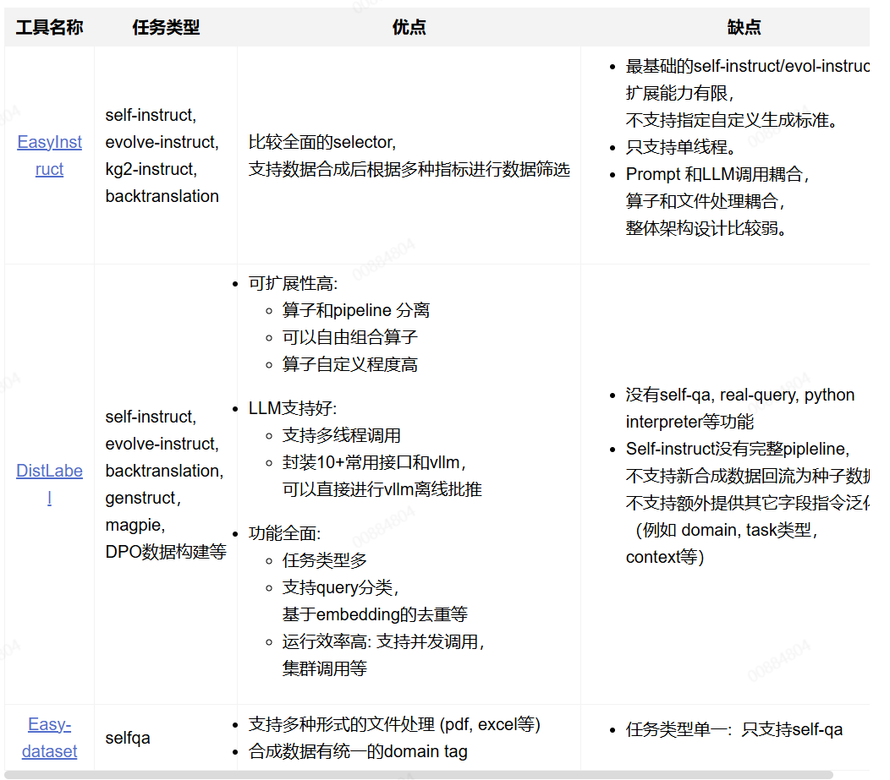

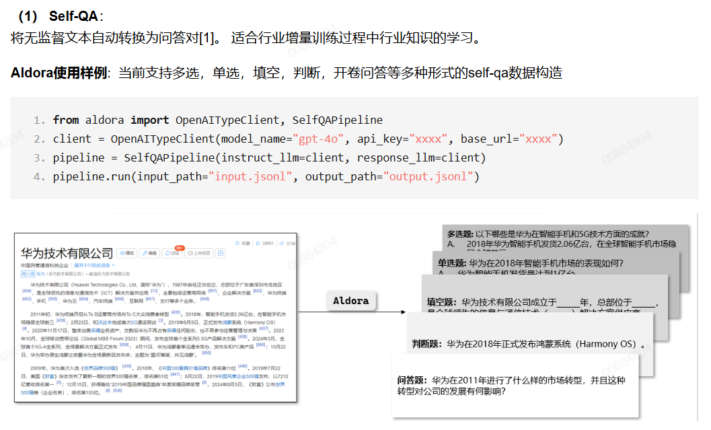

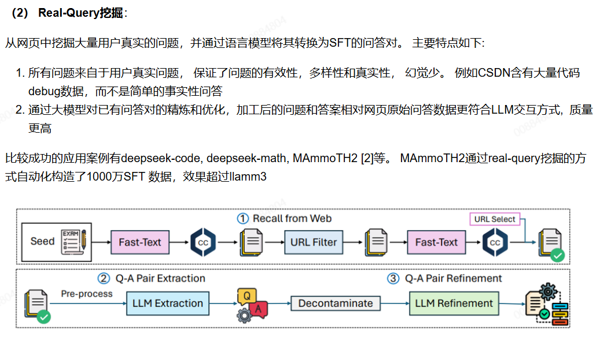

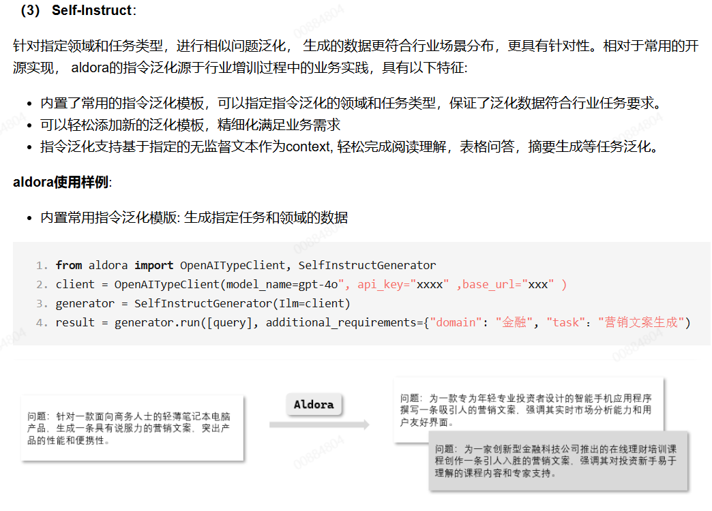

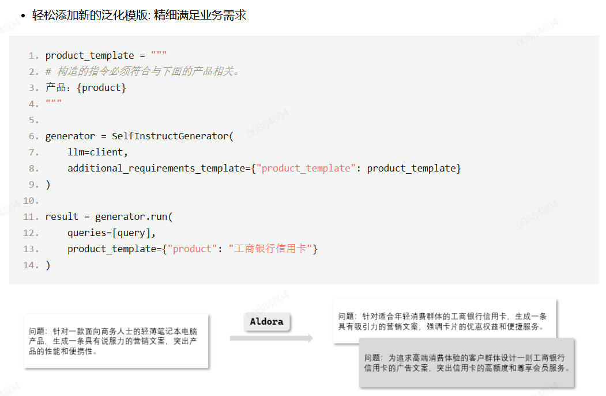

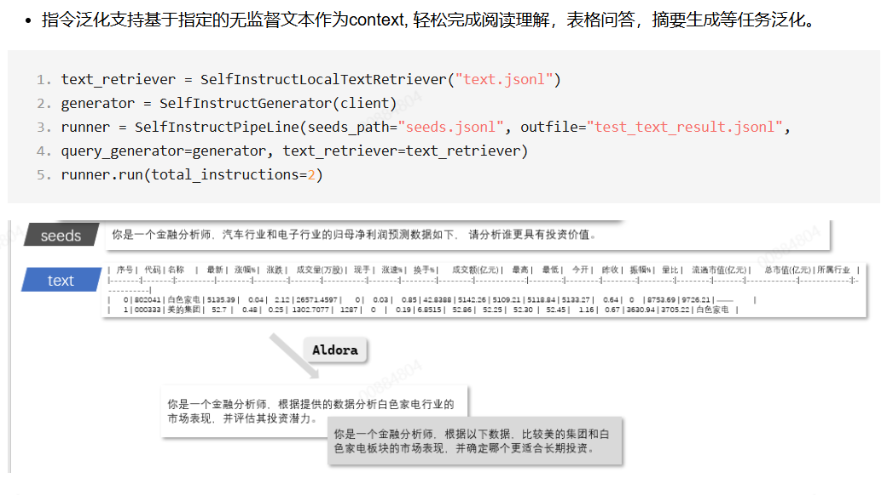
