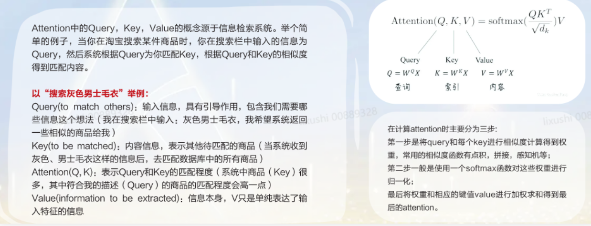

# 网络结构

## 输入部分

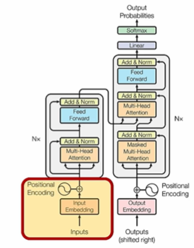

* **源文本嵌入层：**将源文本中的词汇数字表示转换为向量表示，捕捉词汇间的关系。
* **位置编码层：**为输入序列的每个位置生成位置向量，以便模型能够理解序列中的位置信息。
* **目标文本嵌入层（在解码器中使用）：**将目标文本中的词汇数字表示转换为**向量表示**
  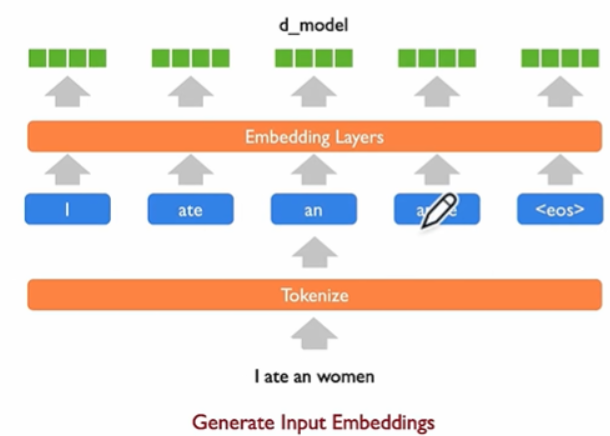

## Encoder

* 由N个编码器层堆叠而成。
* **每个编码器层由两个子层连接结构组成：**第一个子层是多头自注意力子层，第二个子层是一个前馈全连接子层。每个子层后都接有一个规范化层和一个残差连接。
* 学习每个单词/token之间的关联关系，输出学习得到的隐空间特征（latent feature）

具体展开图如下：

* **Transformer中的编码器部分一共N个相同的编码器层组成。**
* **每个编码器层都有两个子层，即多头自注意力层（Multi-Head Attention）层和逐位置的前馈神经网络（Position-wise Feed-Forward Network）。**在每个子层后面都有残差连接（图中的虚线）和层归一化（LayerNorm）操作，二者合起来称为** Add&Norm **操作。
  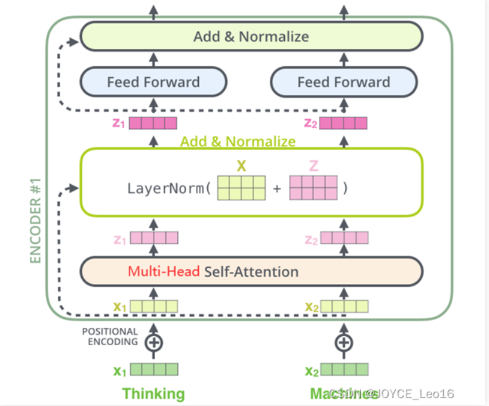

### Multi-Head Attention（多头自注意力）

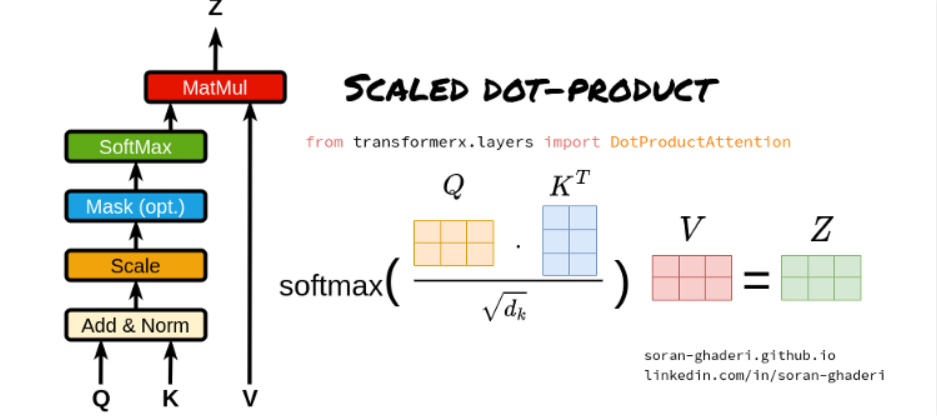

**（1）Query、Key和Value矩阵**

**Query矩阵（Q）：**表示当前的关注点或信息需求，用于与Key矩阵进行匹配。

**Key矩阵（K）：**包含输入序列中各个位置的标识信息，用于被Query矩阵查询匹配。

**Value矩阵（V）：**存储了与Key矩阵相对应的实际值或信息内容，当Query与某个Key匹配时，相应的Value将被用来计算输出。

**（2）点积计算**

通过计算Query矩阵和Key矩阵之间的点积（即对应元素相乘后求和），来衡量Query与每个Key之间的相似度或匹配程度。

**（3）缩放因子**

由于点积操作的结果可能非常大，尤其是在输入维度较高的情况下，这可能导致softmax函数在计算注意力权重时进入饱和区。为了避免这个问题，缩放点积注意力引入了一个缩放因子，通常是输入维度的平方根。点积结果除以这个缩放因子，可以使得softmax函数的输入保持在一个合理的范围内。

**（4）Softmax函数**

将缩放后的点积结果输入到softmax函数中，计算每个Key相对于Query的注意力权重。Softmax函数将原始得分转换为概率分布，使得所有的Key的注意力权重之和为1。

**（5）加权求和**

使用计算出的注意力权重对Value矩阵进行加权求和，得到最终的输出。这个过程根据注意力权重的大小，将更多的关注放在与Query更匹配的Value上。

（2）可视化的过程如下，不同head下的attention得到的注意力权重是不同的

1. **自注意力（Self-Attention）**

   * 源序列和目标序列是同一个！
   * 比如在 BERT 或 GPT 中，每个词既要当 Query（问别人），也要当 Key/Value（被别人问）
   * 此时 **n = m = 序列长度**
   * 例如句子有 5 个词 → n = m = 5
2. Multi-Head Attention 的框架
   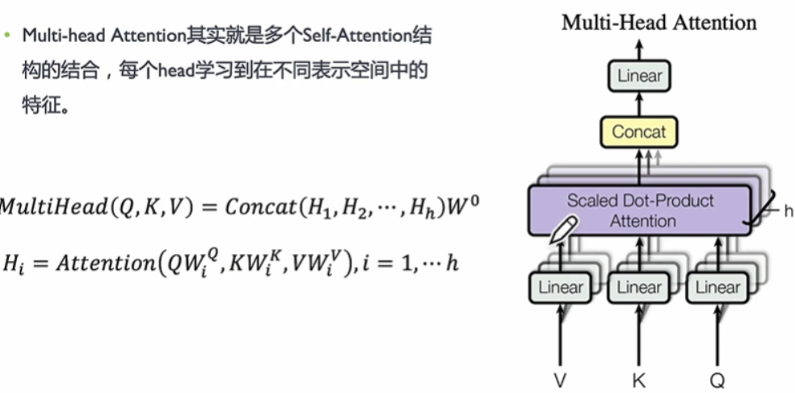

#### Add & Norm（残差设计 & 层归一化）

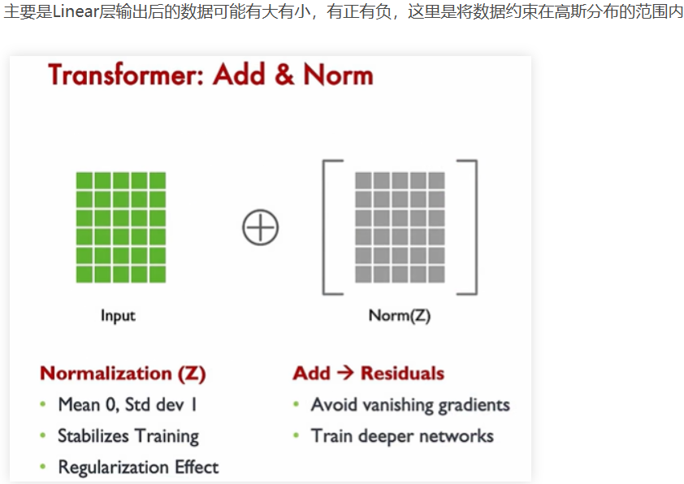

## Decoder

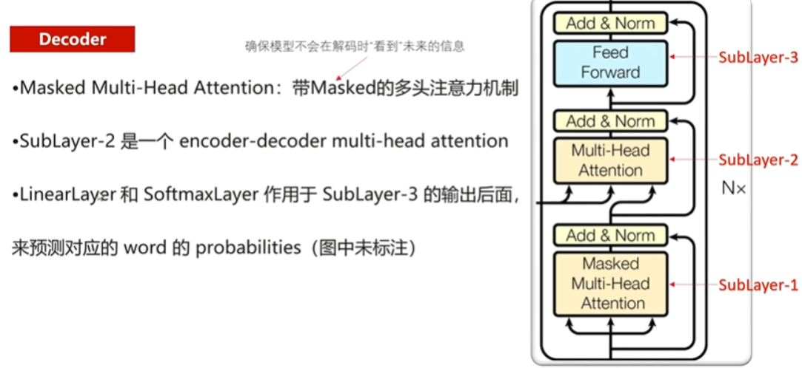
每个解码器层都有三个子层，掩码自注意力层（Masked Self-Attention）、Encoder-Decoder自注意力层、逐位置的前馈神经网络。同样，在每个子层后面都有残差连接（图中的虚线）和层归一化（LayerNorm）操作，二者合起来称为 Add&Norm操作。
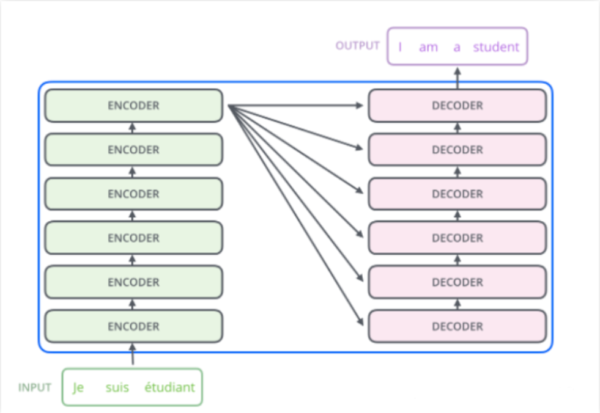
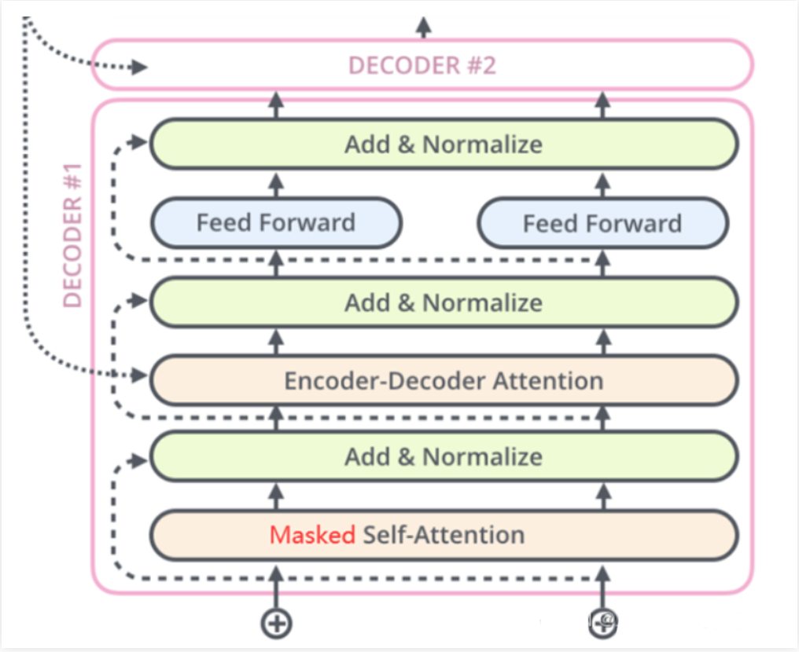
这里的decoder和encoder类似，对于目标文本信息也需要进行学习
训练的时候，当前的单词只关注前面单词的影响，其他做个掩码屏蔽掉
具体的做法如下，有一个掩码矩阵，这样在计算权重的时候就不会被阴影部分影响
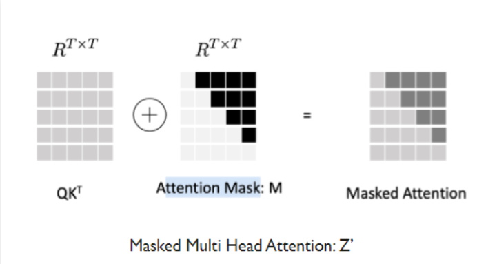

# Multi Latent Attention

从MHA到MLA演化如图所示
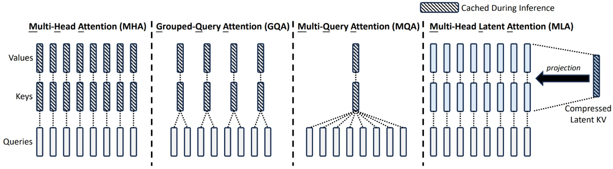
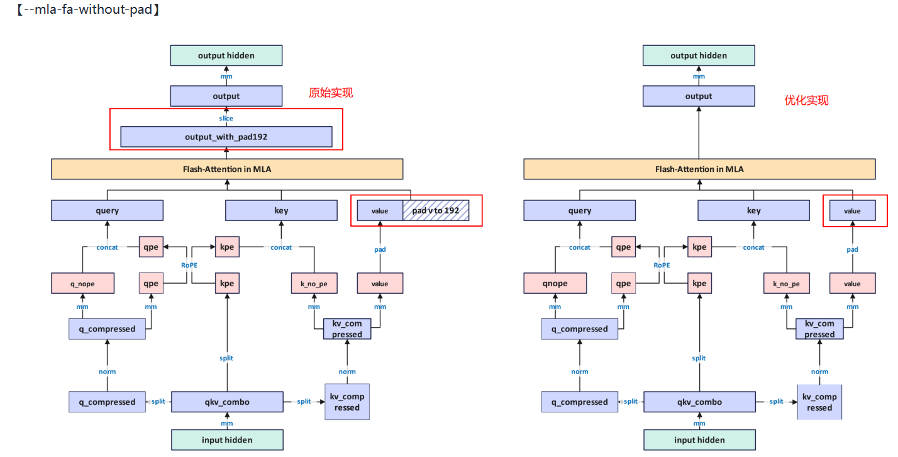
如上图所示：未开启该特性时，当query、key的维度和value的维度不匹配时，会将value维度padding到与query、key相同的维度，然后进入FA进行计算。开启该特性后，在进入FA之前不会进行pad处理，消减pad操作，减少额外显存占用，提升训练性能。