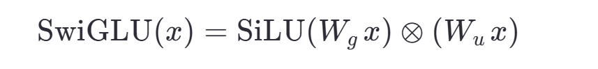
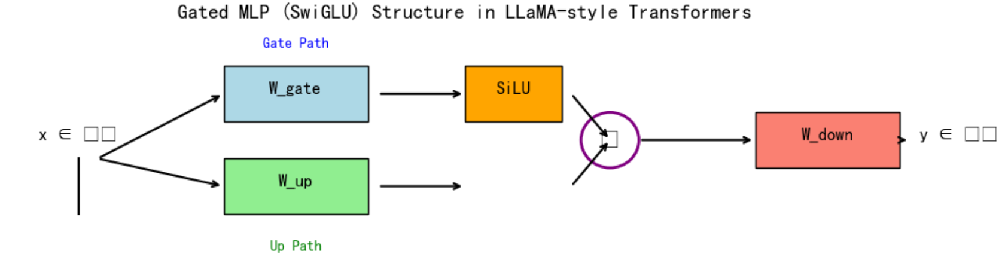

在Hugging Face的Transformer模型中，除了你看到的那些命名外，还有许多其他常见的参数命名模式。以下是完整的命名体系：

## **注意力机制相关**
```
model.layers.{n}.self_attn.q_proj.weight     # 查询投影矩阵
model.layers.{n}.self_attn.k_proj.weight     # 键投影矩阵  
model.layers.{n}.self_attn.v_proj.weight     # 值投影矩阵
model.layers.{n}.self_attn.o_proj.weight     # 输出投影矩阵
model.layers.{n}.self_attn.rotary_emb.inv_freq  # RoPE旋转位置编码
```

## **层归一化参数**
```
model.norm.weight                           # 最终输出层归一化
model.post_attention_layernorm.bias         # 归一化偏置项（如果有）
```

## **分类/解码头相关**
```
lm_head.weight                              # 语言模型输出头
lm_head.bias                                # 输出头偏置
classifier.weight                           # 分类器权重
classifier.bias                             # 分类器偏置
```

## **特殊配置参数**
```
model.embed_tokens.bias                     # 词嵌入偏置
model.layers.{n}.mlp.gate_proj.bias         # MLP门控偏置
model.layers.{n}.input_layernorm.bias       # 层归一化偏置
```

## **多模态模型扩展**
```
vision_model.*                              # 视觉编码器参数
text_model.*                                # 文本编码器参数  
cross_attention.*                           # 跨模态注意力参数
```

## **量化/适配器参数**
```
base_model.model.*                          # LoRA等适配器基础模型
lora_A.* / lora_B.*                         # LoRA适配器参数
quant_state.*                               # 量化状态参数
```

这些命名遵循`模块.层级.组件.参数类型`的层次结构，使得模型架构清晰可读，也便于精确控制参数加载和微调。safetensors格式确保了这种大规模参数存储的安全性和效率。


命名规则解析
1. 模型组件命名模式

model.{组件}.{层}.{子组件}.{参数类型}
2. 具体组件含义
model.embed_tokens.weight

词嵌入层权重
负责将输入token转换为向量表示
model.layers.0.*

第0层Transformer层的各组件
数字递增表示不同层（0, 1, 2...）
Layer内部组件：

input_layernorm.weight: 输入层归一化权重
post_attention_layernorm.weight: 注意力后层归一化权重
mlp.*: 多层感知机（前馈网络）组件
down_proj: 下投影层
gate_proj: 门控投影层
up_proj: 上投影层

**MLP（多层感知机）模块**不再是传统的“线性 → 激活 → 线性”两层结构，而是采用了 **Gated MLP（门控多层感知机）**，也称为 **SwiGLU MLP**

### 🔧 1. 标准 Gated MLP 结构（以 LLaMA 为例）

对每个 Transformer 层，MLP 包含 **3 个可学习权重矩阵**：

```python
# 输入: x ∈ ℝ^d
gate = self.gate_proj(x)           # ∈ ℝ^{intermediate_size}
up   = self.up_proj(x)             # ∈ ℝ^{intermediate_size}
activated_gate = SiLU(gate)        # SiLU = Swish = x * sigmoid(x)
down_input = activated_gate * up   # 逐元素相乘（门控机制）
output = self.down_proj(down_input) # 投影回 d 维
```

因此，参数命名对应如下：

| 参数名 | 作用 | 形状 |
|--------|------|------|
| `mlp.gate_proj.weight` | 门控路径投影（经 SiLU 激活） | `(intermediate_size, hidden_size)` |
| `mlp.up_proj.weight`   | 主路径投影（与门控相乘） | `(intermediate_size, hidden_size)` |
| `mlp.down_proj.weight` | 输出投影（降维回 `hidden_size`）| `(hidden_size, intermediate_size)` |

> 📌 注意：`gate_proj` 和 `up_proj` 通常 **并行计算**，然后逐元素相乘，再送入 `down_proj`。

---

### 🌟 2. 为什么叫 “Gated” 或 “SwiGLU”？

- **GLU（Gated Linear Unit）** 原始形式：`GLU(x) = σ(Wx + b) ⊗ (Vx + c)`
- **SwiGLU** 是 GLU 的变种，将 sigmoid 激活换成 **Swish/SiLU**：
  
 

  其中 ⊗ 表示逐元素乘法（Hadamard product）。



- 这种结构比 ReLU MLP 表达能力更强，已被 LLaMA、PaLM、Grok-1 等主流模型采用。

---

### 📦 3. 与传统 MLP 的对比

| 类型 | 结构 | 参数量 | 表达能力 |
|------|------|--------|--------|
| 传统 MLP | `Linear → ReLU → Linear` | 2 个权重 | 中等 |
| **Gated MLP (SwiGLU)** | `Linear (gate) + Linear (up) → SiLU ⊗ → Linear (down)` | **3 个权重** | **更强** |

> 💡 虽然多了一个权重矩阵，但中间维度（`intermediate_size`）通常设为 `hidden_size × 2/3 × 2`（例如 LLaMA-7B：4096 → 11008），整体计算量仍在可控范围。

---

### 🔍 4. 在你提供的权重映射中的体现

```json
"model.layers.0.mlp.down_proj.weight"
"model.layers.0.mlp.gate_proj.weight"
"model.layers.0.mlp.up_proj.weight"
```

- 这三个 weight 正是 Gated MLP 的核心三组件
- 所有 Transformer 层（`layers.0`, `layers.1`, ..., `layers.N-1`）都包含这样一套 MLP

---

### ✅ 总结

- 你看到的 `mlp.gate_proj` / `up_proj` / `down_proj` 是 **现代大语言模型的标准 Gated MLP（SwiGLU）实现**
- 它通过 **门控机制** 提升模型非线性表达能力
- 结构更复杂但效果显著优于传统 ReLU MLP
- 这是 LLaMA 架构的关键设计之一，也被 Qwen、Phi、Gemma 等后续模型广泛采用

如果你在做模型微调、结构修改或张量操作，理解这三者的计算流程非常重要（尤其是 `gate_proj` 和 `up_proj` 是并行的，不是串行的）。