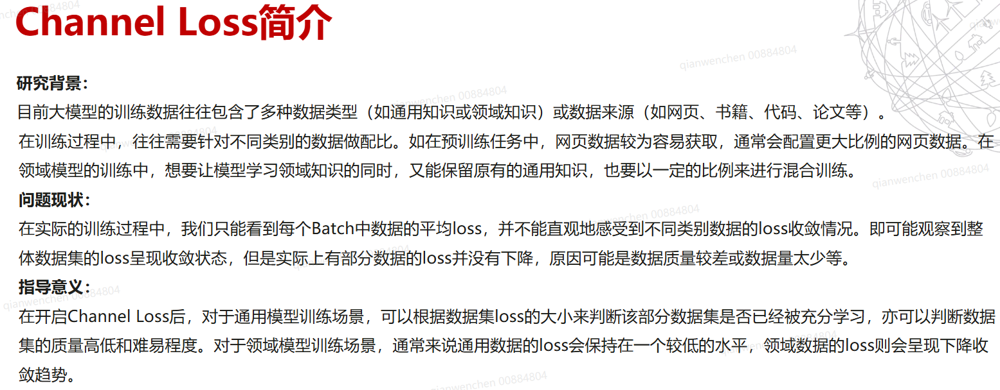
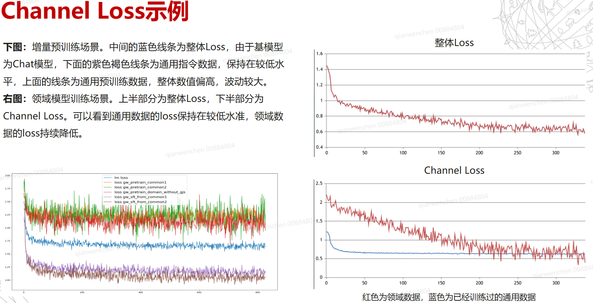
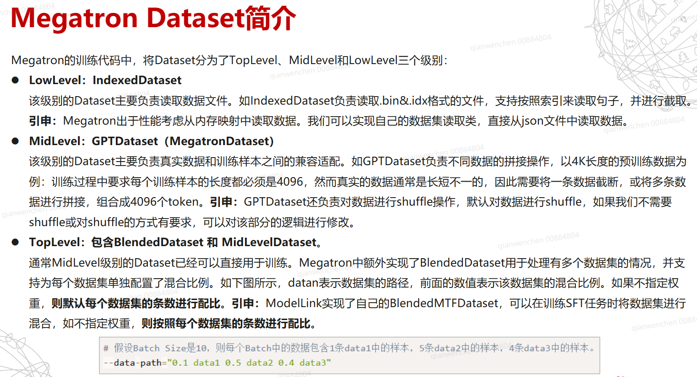
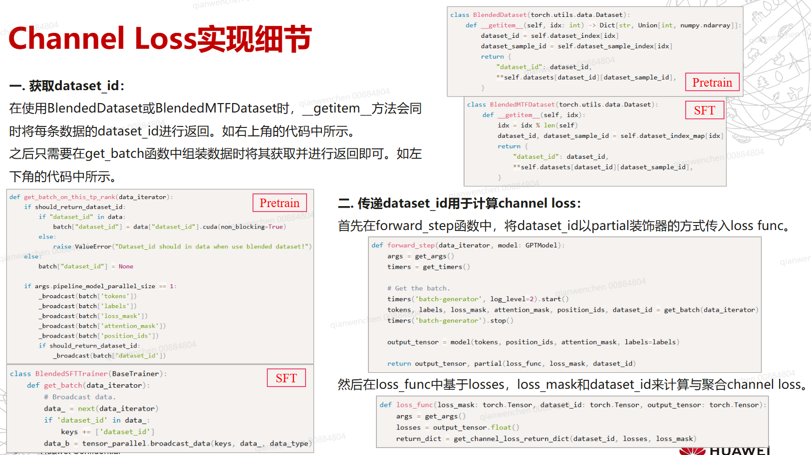
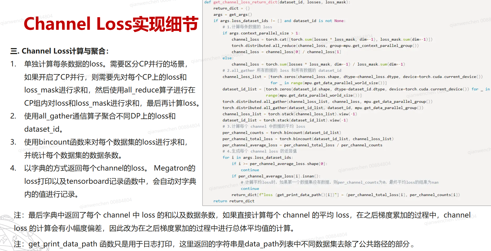
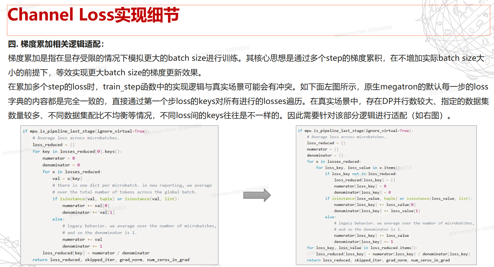
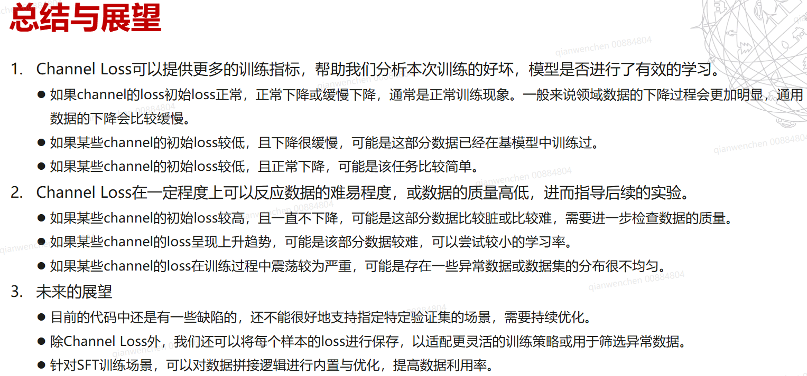
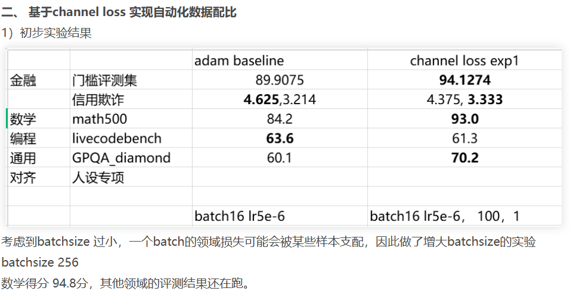
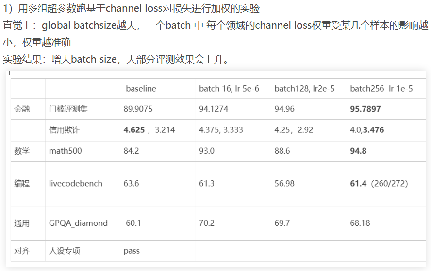
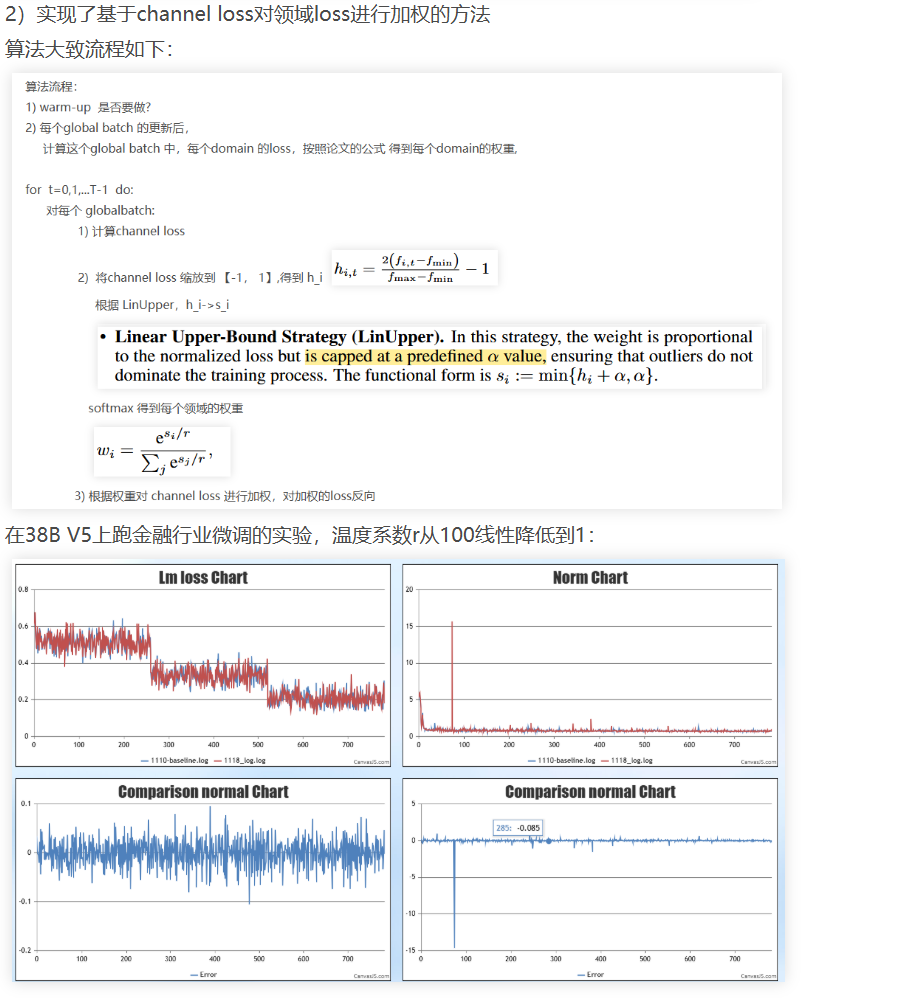

loss scale
行业大模型增量预训练通常伴随着大量数据以及较长的训练时长，增量预训练完成后通常还需要SFT重新对齐为可对话的chat模型，此时进行评测后发现模型效果劣化严重可能已经浪费了许多宝贵的时间以及算力。megatron原生的loss打印机制为打印一个batch所有token的平均loss，在行业增训常见的行业与通用数据比例1:5的场景下难以有效地观察到行业数据的训练情况，为此我们需要channel loss功能，能够分别打印一个batch内不同数据的loss，以此观察模型对不同数据的学习情况，在行业数据质量过差时能够及时的发现，为我们争取到更多的时间。

基于Megatron Dataset实现channel loss，提供更多训练指标

在此基础上，参考Dynamic Loss-Based Sample Reweighting for Improved Large Language Model Pretraining论文，实现基于channel loss对损失进行加权，在金融，数学，编程等评测集均取得效果提升。
















你提供的 `get_batch` 函数是**大规模分布式训练框架**（如 Megatron-LM）中的一个关键数据加载组件。它负责在**复杂的并行策略**（TP + PP + CP + DP）下，从全局数据流中为当前 GPU **正确切分并返回一个本地 batch**，同时支持多数据集混合训练、位置编码重置、调试打印等高级功能。

### 一、整体目标

> **为当前 GPU（rank）准备一个符合其并行角色的 mini-batch，确保：**
>
> - 数据在 TP（张量并行）维度正确切分；
> - 序列在 CP（上下文并行）维度正确切片；
> - 非首/尾 PP（流水线并行）阶段不加载完整数据（节省内存）；
> - 支持多数据集混合训练（通过 `dataset_id`）；

---

### 二、背景知识：四种并行策略

在 Megatron-LM 或类似框架中，训练大模型通常采用组合并行：


| 并行类型       | 缩写 | 作用                                 | 对 batch 的影响                       |
| -------------- | ---- | ------------------------------------ | ------------------------------------- |
| **数据并行**   | DP   | 不同 GPU 处理不同样本                | 每个 DP rank 拿到不同 batch           |
| **张量并行**   | TP   | 模型层内权重切分                     | 输入 token embedding 需在 TP 维度切分 |
| **流水线并行** | PP   | 模型层间切分到不同 GPU               | 只有首/尾 stage 需要完整 input/output |
| **上下文并行** | CP   | **序列长度切分**（如 8K 切成 4×2K） | 序列需在 CP 维度切片                  |

> 💡 你的环境使用 **NPU**，且涉及 `mpu.get_context_parallel_group()`，说明启用了 **CP（Context Parallelism）** ——这是处理超长上下文的关键技术。

---

### 三、代码逐段详解

#### 1. **提前退出：中间 PP stage 不需要完整 batch**

```python
is_middle_stage = not (mpu.is_pipeline_first_stage() or mpu.is_pipeline_last_stage())
pretrain_not_tnd_flags = not args.is_instruction_dataset and not args.reset_position_ids
if pretrain_not_tnd_flags and is_middle_stage:
    return (None,) * 5
```

- **为什么**？
  - 在 PP 中，**中间 stage 只接收前一 stage 的 activation，不直接读原始数据**；
  - 它们不需要 `input_ids`, `attention_mask` 等原始输入，只需做 forward/backward。
- **条件限制**：
  - `not args.is_instruction_dataset`：如果是 SFT（指令数据），可能需要 metadata（如 `dataset_id`），不能直接跳过；
  - `not args.reset_position_ids`：若需重置 position id（如 CP 场景），可能仍需部分信息。
- **返回 `(None,) * 5`**：假设下游 expect 5 个返回值（如 input_ids, labels, loss_mask, attention_mask, dataset_id）。

✅ **节省内存和通信开销**。

---

#### 2. **从 data_iterator 获取 TP 切分后的 batch**

```python
batch, actual_seq_len = get_batch_on_this_tp_rank(data_iterator)
```

- **`get_batch_on_this_tp_rank`** 是另一个函数，负责：
  - 从全局 batch 中，**按 TP rank 切分 embedding 维度**（如 vocab parallel）；
  - 但**序列维度（sequence length）仍是完整的**（后续 CP 会切）；
- **`actual_seq_len`**：当前 batch 中**实际最大序列长度**（可能 < `args.seq_length`），用于 CP 和 position id 重置。

> 📌 注意：此时 `batch` 是一个 dict，包含：
>
> ```python
> {
>   'input_ids': [B, L],       # 可能已 TP 切分
>   'labels': [B, L],
>   'loss_mask': [B, L],
>   'attention_mask': [B, L],
>   'dataset_id': [B],
>   'document_ids': [B],       # 仅调试用
>   'idx': [B],                # 仅调试用
> }
> ```

---

#### 4. **处理 position id 重置（用于 CP 或长上下文）**

```python
if args.reset_position_ids and not args.reset_attention_mask:
    generate_actual_seq_len(batch, actual_seq_len)
```

- **背景**：在 CP 中，序列被切成多段（如 [0:2K], [2K:4K]...），每段的 position id 应从 0 开始，而非全局 0~8K；
- **`generate_actual_seq_len`**：可能用于生成 per-segment 的 position ids；
- **条件 `not reset_attention_mask`**：说明 attention mask 已由 CP 逻辑处理，无需重置。

> 🔧 这是 **上下文并行**（CP） 的关键配套逻辑。

---

#### 5. **核心：CP 切片 —— 沿序列维度切分 batch**

```python
dataset_id = batch["dataset_id"]
batch["dataset_id"] = None
batch = get_batch_on_this_cp_rank(batch)
batch["dataset_id"] = dataset_id
```

- **为什么单独处理 `dataset_id`**？

  - `dataset_id` 是 **per-sample 标量**（shape `[B]`），**不随序列长度变化**；
  - 而 `input_ids`, `labels` 等是 `[B, L]`，需要在 **L 维度切分**；
  - `get_batch_on_this_cp_rank` 函数内部会对 `[B, L]` 张量按 CP rank 切片（如 rank 0 拿 L//CP ~ 2L//CP）；
  - 但若传入 `dataset_id`（shape `[B]`），切片会出错（维度不匹配）。
- **所以临时移除 `dataset_id` → CP 切片 → 再加回来**。

#### 6. **返回**

```python
return batch.values()
```

- 返回 dict 的 values（如 `input_ids, labels, loss_mask, attention_mask, dataset_id`）；
- 顺序需与模型 forward 的参数顺序一致。

---

### 四、关键机制总结


| 机制                                | 作用                            |
| ----------------------------------- | ------------------------------- |
| **PP 中间 stage 跳过数据加载**      | 节省内存，符合 PP 数据流        |
| **TP 切分在 data loading 阶段完成** | 避免后续通信                    |
| **CP 切片在序列维度进行**           | 支持超长上下文训练              |
| **dataset_id 不参与 CP 切片**       | 保护 per-sample metadata 完整性 |
| **调试信息仅 rank 0 打印**          | 避免日志冗余                    |

✅ `get_batch` 正是这一切的**数据入口**：

- 它确保 **每个 GPU 拿到正确的数据切片**；
- 保留 `dataset_id` 供后续 `get_channel_loss_return_dict` 统计 per-dataset loss；
- 通过 `actual_seq_len` 和 position id 重置，**支持 CP 下的正确训练**。

---

### 总结

`get_batch` 是一个**高度适配 Megatron-LM 分布式训练范式的数据加载函数**，它在**TP/PP/CP/DP 四重并行**下，精确地为每个 GPU 提供所需的数据切片，同时保留多数据集训练所需的 metadata（如 `dataset_id`），并支持超长上下文和调试需求。
**它是你实现“领域增量预训练 + chat 能力保留”这一复杂训练目标的底层数据保障**。

## 数据配比

### 数据集

1）按照token数量

设置初始比例  20M

设置 Budget： 金融：数学：编程：逻辑+对话= 3:2:2:3

1， 5M

2）按照条数 5.2W 条

金融1W:

慢思考:   信贷2个(482) + 金融对齐(572) +问答(182) +Openfindata(2363) + 文本生成 (113) 总共 3712 /   快思考：fast\_finance\_40k\_debug.json 和 fast\_icbc\_0327.json 中采样 16300 条样本。

数学1W:  慢 7.5K，快2.5K

编程1W: 慢 7.5K，快2.5K

逻辑1W： 慢 7.5K，快2.5K

通用1W: 对齐: 慢 7.5K，快2.5K， +对齐(2113)

reasoning : non-reasoning data ？ 参考R1的技术报告 3:1










动机：**为什么要在训练过程中动态的reweight？**

as the model learns it could be beneficial to reduce its weight

有些样本训练初期很难学，赋予大权重，随着训练进度学到了，权重可以降低。

样本量很多，无法记录每个样本的损失


