pangu38B模型适配muon优化器，在金融行业微调

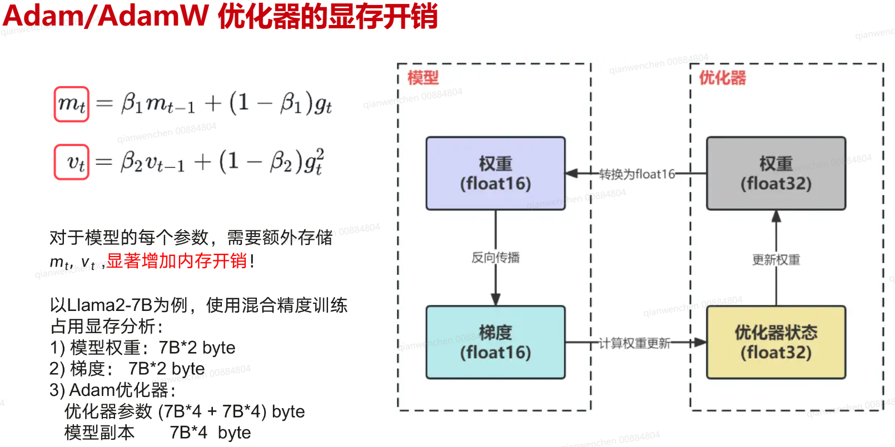
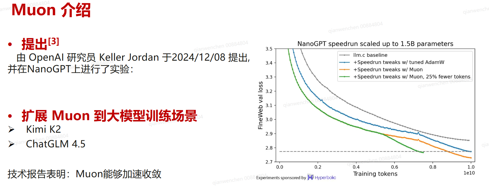
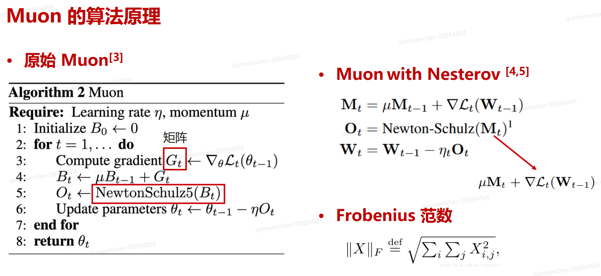
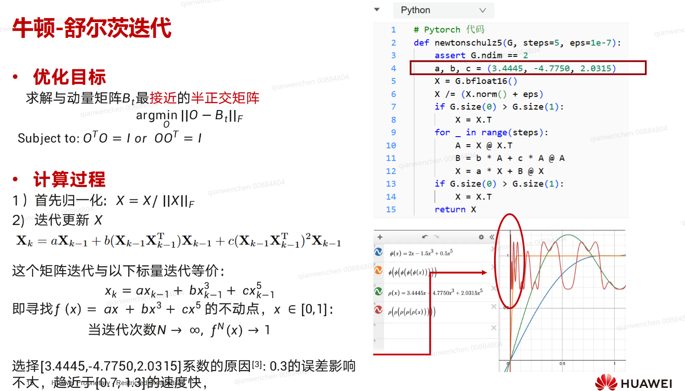
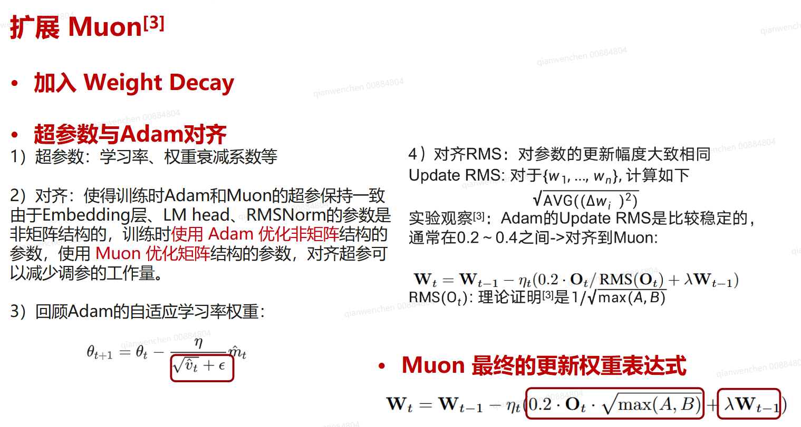
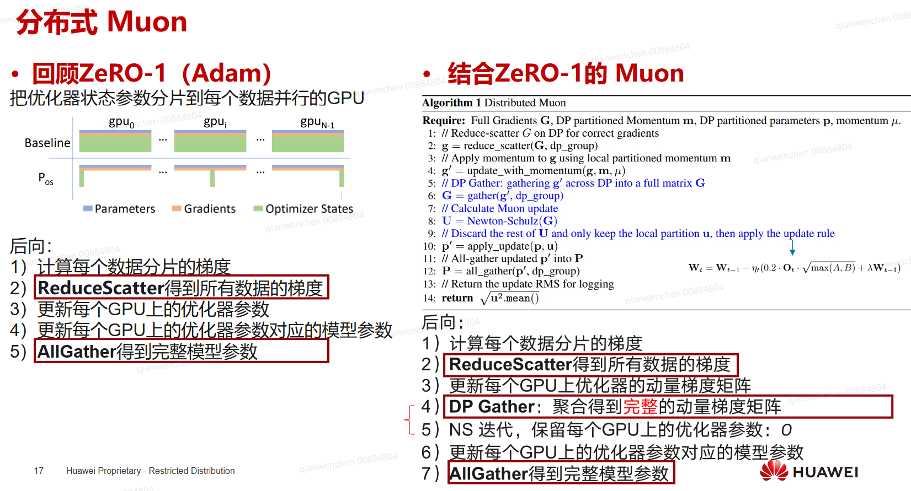
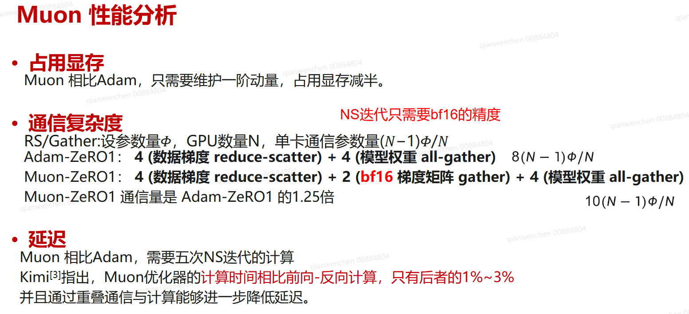
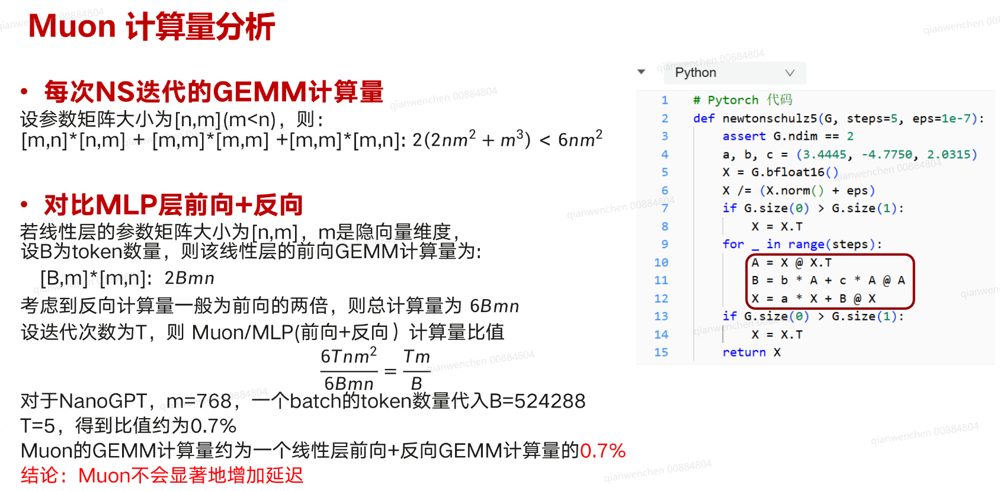
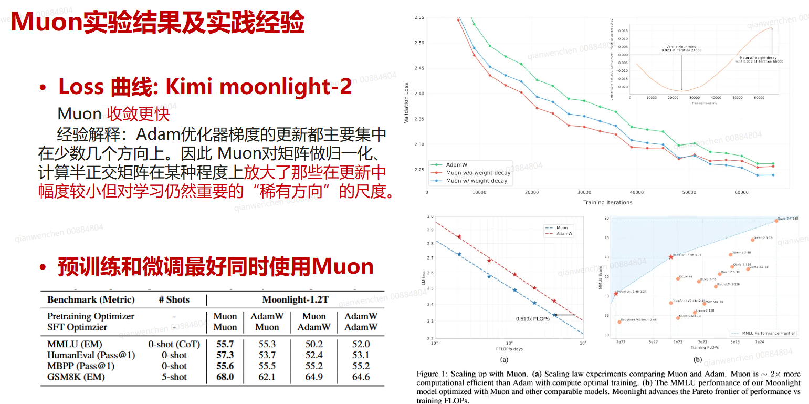
## muon优化器效果实验
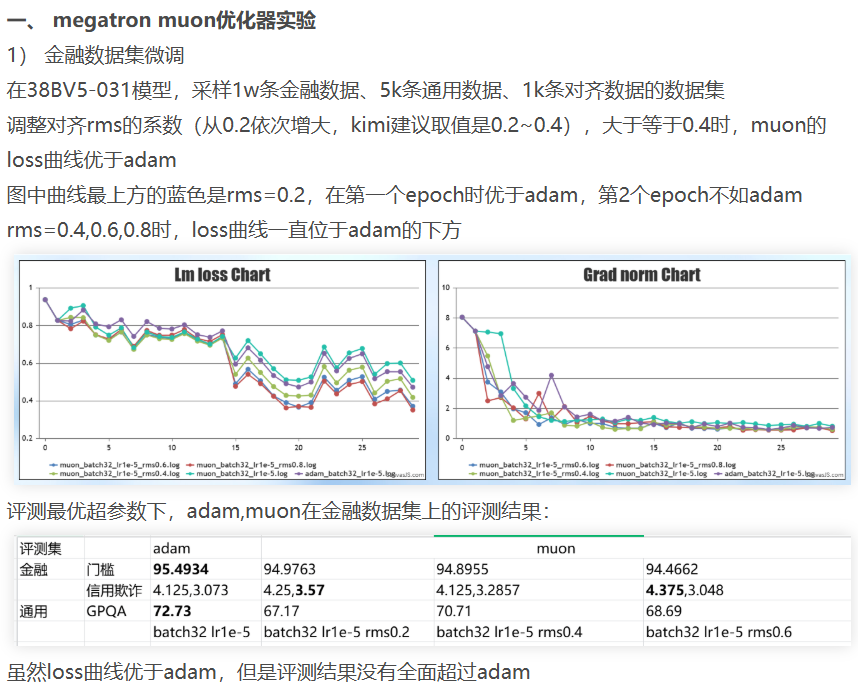
一、muon 金融微调实验

在38BV5031模型上首先用adam寻找最优的超参: batch 32/64  lr5e-6/1e-5/2e-5

训练loss最小超参： batch 32 lr1e-5，在此超参上调整muon的超参，muon-matched-adam-rms系数设为0.4时

muon的loss曲线优于adam
## muon优化器性能测试
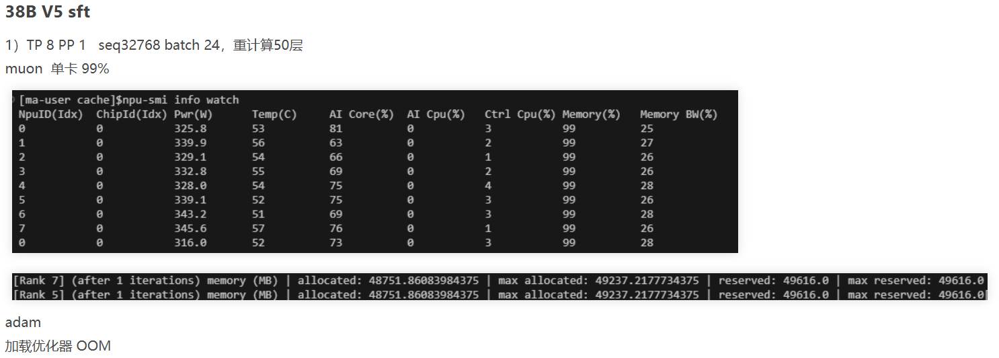