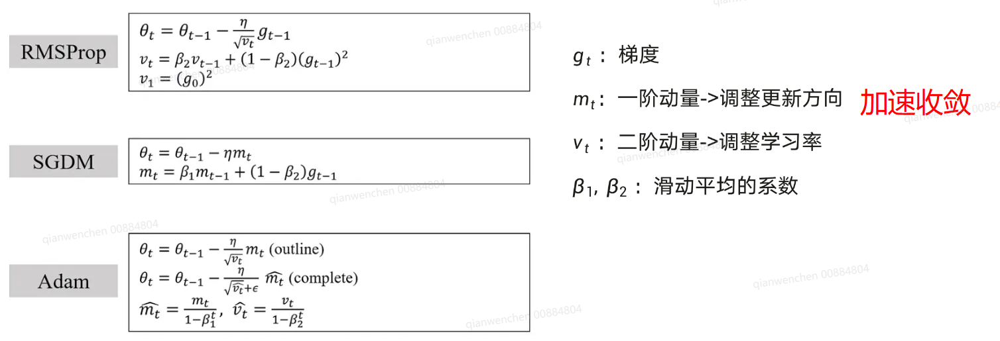
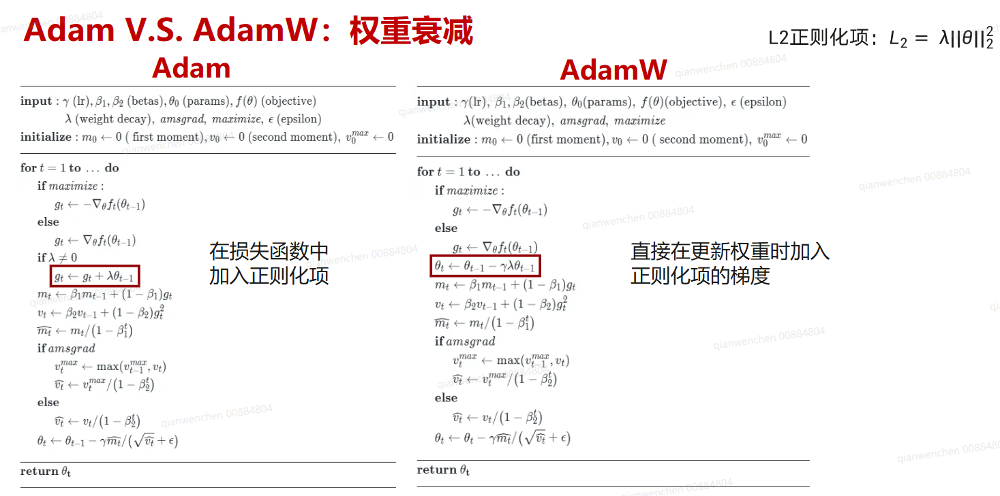

pangu38B模型适配muon优化器，在金融行业微调实验
在原有并行策略下CP2 PP4 TP8  38B模型，训练128k序列长度数据集，相比于使用adam优化器可减少一半卡数

在相同卡数下

保证精度对齐的情况下，同样的序列长度微调相比于使用adam优化器可减少一半卡数，收敛速度更快，在金融领域多个评测集下

seq128k batch32

TP8PP4 （亲和组容量2） 910C

## muon优化器效果实验

一、muon 金融微调实验

在38BV5031模型上首先用adam寻找最优的超参: batch 32/64  lr5e-6/1e-5/2e-5

训练loss最小超参： batch 32 lr1e-5，在此超参上调整muon的超参，muon-matched-adam-rms系数设为0.4时

muon的loss曲线优于adam

## muon优化器性能测试

